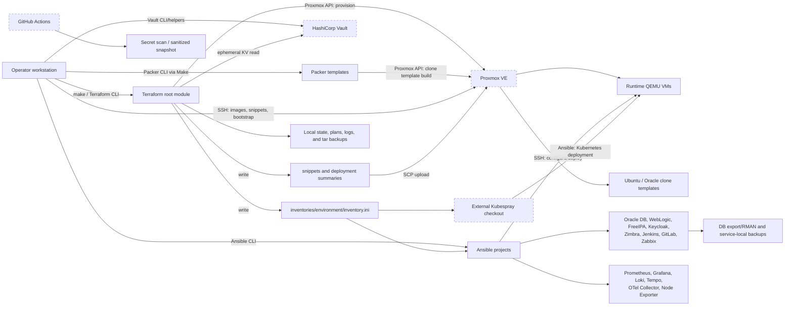
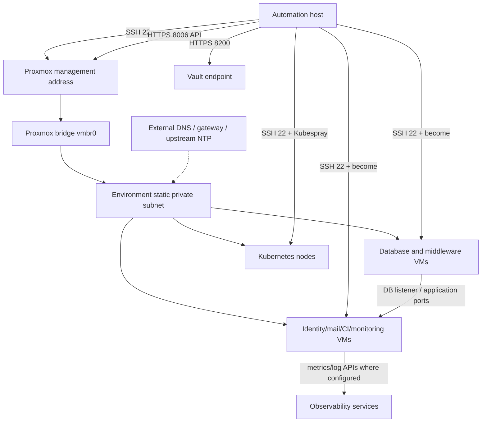

# Project Operating System

| Field | Value |
| --- | --- |
| Project | IaC-Homelab / Automated IT Infrastructure |
| Repository purpose | Provision and configure a Proxmox homelab with Terraform, Packer, Vault, cloud-init, Kubespray, and Ansible |
| Document purpose | Authoritative operator reference for the repository's current, evidenced behavior |
| Last reviewed | 2026-07-14 |
| Git branch inspected | `dev` |
| Git commit inspected | `135302f8067f3ca13851778b5f3e3367161a63c3` |
| Document status | Partially Verified |

> **Infrastructure warning:** Review the selected Terraform workspace, variable file, plan, inventory, and external target before running any state-changing command. Commands marked **Destructive** can delete VMs, templates, Vault data, state, credentials, or local recovery material.

This document uses four evidence labels:

- **Confirmed** means the behavior is directly encoded in the cited repository path or was verified with a safe local inspection command.
- **Inferred from: `<path>`** means the configuration strongly supports the conclusion, but runtime infrastructure was not queried to prove it.
- **Unknown - requires confirmation** means the repository does not establish the answer.
- **Recommended** means an operational improvement, not current behavior.

Network addresses and credential values are deliberately omitted. Placeholders such as `<ENVIRONMENT_NAME>`, `<PROXMOX_HOST>`, `<SSH_PRIVATE_KEY_PATH>`, and `<VAULT_TOKEN>` must be replaced locally.

**Document maintenance contract:**

`PROJECT_OPERATING_SYSTEM.md` must change with the system it describes. Every infrastructure, configuration, inventory, variable, operational command, pipeline, script, dependency, security control, backup, recovery, or service-lifecycle change must update the affected statements and procedures here in the same change. Delete documentation that no longer describes the repository; do not preserve stale behavior as current guidance. When an AI agent discovers repository-backed behavior, risk, dependency, or operating knowledge that is not covered here, it must add that finding with the appropriate Confirmed, Inferred, Unknown, or Recommended label. Documentation-only omission is not a reason to leave a new finding undocumented.

## Table of Contents

- [1. Executive Summary](#1-executive-summary)
- [2. System Architecture](#2-system-architecture)
- [3. Repository Map](#3-repository-map)
- [4. End-to-End Workflow](#4-end-to-end-workflow)
- [4.1 Clone and install prerequisites](#41-clone-and-install-prerequisites)
- [4.2 Configure authentication](#42-configure-authentication)
- [4.3 Create or select an environment](#43-create-or-select-an-environment)
- [4.4 Establish Proxmox access and image/template prerequisites](#44-establish-proxmox-access-and-imagetemplate-prerequisites)
- [4.5 Initialize and validate Terraform](#45-initialize-and-validate-terraform)
- [4.6 Render, upload, plan, and apply](#46-render-upload-plan-and-apply)
- [4.7 Validate inventory and configure hosts](#47-validate-inventory-and-configure-hosts)
- [4.8 Deploy Kubernetes](#48-deploy-kubernetes)
- [4.9 Health checks, updates, and decommissioning](#49-health-checks-updates-and-decommissioning)
- [5. Execution Entry Points](#5-execution-entry-points)
- [6. Component Deep Dives](#6-component-deep-dives)
- [6.1 Terraform and Proxmox](#61-terraform-and-proxmox)
- [6.2 Vault helpers](#62-vault-helpers)
- [6.3 Packer, images, and cloud-init](#63-packer-images-and-cloud-init)
- [6.4 Inventory and Ansible baseline](#64-inventory-and-ansible-baseline)
- [6.5 Oracle Database](#65-oracle-database)
- [6.6 WebLogic](#66-weblogic)
- [6.7 Identity, mail, CI/CD, and monitoring services](#67-identity-mail-cicd-and-monitoring-services)
- [6.8 Kubernetes](#68-kubernetes)
- [6.9 CI/CD and sanitized publication](#69-cicd-and-sanitized-publication)
- [7. Infrastructure Inventory](#7-infrastructure-inventory)
- [7.1 Desired committed `dev` topology](#71-desired-committed-dev-topology)
- [7.2 Local `example` test topology and state](#72-local-example-test-topology-and-state)
- [7.3 Existing dependencies consumed, not created](#73-existing-dependencies-consumed-not-created)
- [8. Networking Model](#8-networking-model)
- [9. Configuration and Variables](#9-configuration-and-variables)
- [9.1 Terraform root variables](#91-terraform-root-variables)
- [9.2 Terraform locals and outputs](#92-terraform-locals-and-outputs)
- [9.3 Packer and Make/script variables](#93-packer-and-makescript-variables)
- [9.4 Ansible variable families](#94-ansible-variable-families)
- [10. State and Generated Data](#10-state-and-generated-data)
- [11. Authentication, Secrets, and Security](#11-authentication-secrets-and-security)
- [12. Naming and Conventions](#12-naming-and-conventions)
- [13. Environment Management](#13-environment-management)
- [14. Normal Operations Runbook](#14-normal-operations-runbook)
- [14.1 Initial deployment](#141-initial-deployment)
- [14.2 Plan or dry-run](#142-plan-or-dry-run)
- [14.3 Apply approved infrastructure changes](#143-apply-approved-infrastructure-changes)
- [14.4 Apply configuration changes](#144-apply-configuration-changes)
- [14.5 Add a VM or Ansible host](#145-add-a-vm-or-ansible-host)
- [14.6 Add a Kubernetes node](#146-add-a-kubernetes-node)
- [14.7 Update an image or template](#147-update-an-image-or-template)
- [14.8 Change CPU, memory, storage, or networking](#148-change-cpu-memory-storage-or-networking)
- [14.9 Update dependencies](#149-update-dependencies)
- [14.10 Rotate credentials](#1410-rotate-credentials)
- [14.11 Health, logs, and backups](#1411-health-logs-and-backups)
- [14.12 Remove or decommission a resource](#1412-remove-or-decommission-a-resource)
- [15. Validation and Testing](#15-validation-and-testing)
- [15.1 Prodesk integration evidence (2026-07-15)](#151-example-integration-evidence-2026-07-15)
- [16. Logging, Monitoring, and Observability](#16-logging-monitoring-and-observability)
- [17. Backup, Restore, and Disaster Recovery](#17-backup-restore-and-disaster-recovery)
- [18. Troubleshooting Guide](#18-troubleshooting-guide)
- [19. Failure Recovery and Rollback](#19-failure-recovery-and-rollback)
- [Terraform partial-apply procedure](#terraform-partial-apply-procedure)
- [Ansible partial-run procedure](#ansible-partial-run-procedure)
- [20. Dependency and Compatibility Matrix](#20-dependency-and-compatibility-matrix)
- [21. Extension Guide](#21-extension-guide)
- [Add a Terraform resource or module](#add-a-terraform-resource-or-module)
- [Add an Ansible role or playbook](#add-an-ansible-role-or-playbook)
- [Add an environment](#add-an-environment)
- [Cross-component change checklist](#cross-component-change-checklist)
- [22. Known Gaps, Risks, and Technical Debt](#22-known-gaps-risks-and-technical-debt)
- [23. Quick Reference](#23-quick-reference)
- [24. Glossary](#24-glossary)
- [25. Open Questions](#25-open-questions)

## 1. Executive Summary

**Confirmed:** This repository is a layered automation system for a Proxmox-based homelab. It creates Proxmox QEMU VMs and an optional Proxmox resource pool, manages Vault access resources, builds clone templates with Packer, renders cloud-init partitioning snippets, generates Ansible inventory, deploys Kubernetes through an external Kubespray checkout, and configures Linux accounts, time synchronization, databases, middleware, identity, observability, mail, and CI/CD services.

The operational problem is repeatability. Instead of creating VMs in the Proxmox UI and configuring each service manually, the repository keeps desired VM topology in environment `.tfvars` files and desired host/service configuration in Ansible inventories, group variables, playbooks, roles, and templates. Terraform's generated inventory is the handoff between provisioning and configuration management.

| Area | Current repository boundary |
| --- | --- |
| Infrastructure platform | Proxmox VE QEMU VMs, clone templates, storage, bridge attachment, cloud-init, and an optional pool |
| Secret control plane | HashiCorp Vault KV v2, policy, AppRole backend/role, and local authentication helpers |
| Host images | Packer clone builds for Ubuntu 24.04, Oracle Linux 8, and Oracle Linux 9 |
| Configuration | Ansible host baselines and service-specific playbooks |
| Kubernetes | Nodes are provisioned by Terraform; an external Kubespray checkout configures the cluster |
| Observability | Prometheus, Grafana, Loki, Tempo, OpenTelemetry Collector, Node Exporter, and a separate Zabbix server role |
| CI/CD services | Jenkins controller/agents and GitLab CE/runners |
| Release controls | Gitleaks and sanitized-snapshot workflows/scripts |

Intended users are infrastructure engineers operating from a Linux automation host with SSH access to Proxmox and guests. The committed tool model uses Python/pyenv, Terraform, Packer, Vault CLI, Ansible, Make, Bash, `jq`, and optional validation tools.

**Confirmed project exclusions:** The repository does not configure physical Proxmox installation, switches, routers, NAT, DHCP, authoritative external DNS, load balancers, a remote Terraform backend, a container registry, Kubernetes applications/Helm releases, alert routing, or a complete VM/Kubernetes disaster-recovery system. External DNS records for FreeIPA and the external Kubespray checkout remain operator-owned.

## 2. System Architecture



Normal control flow is:

1. The operator supplies environment topology and non-secret settings through `terraform-proxmox/environments/<env>.tfvars` and local environment files.
2. Vault helpers authenticate and read or rotate the Proxmox API fields stored at the configured KV mount/prefix/environment path.
3. Packer clones high-numbered base VMs into reusable `ubuntu2404`, `oracle8`, and `oracle9` templates.
4. Terraform selects a workspace, reads Proxmox credentials ephemerally from Vault, creates or updates VMs, and writes partitioning snippets, inventory, and a JSON deployment summary.
5. Snippets are uploaded to a Proxmox storage that supports `snippets`; cloud-init partitions and mounts data disks during guest initialization.
6. Ansible consumes the generated inventory plus `inventories/aliases.ini`, applies account/time baselines, then installs service roles in dependency order.
7. For Kubernetes, `make k8s-deploy` invokes `cluster.yml` from an external Kubespray checkout with the same inventory and aliases.
8. Make retains checksummed Terraform archives on the automation host, service roles retain logical backups inside selected guests, and policy-owned PVE jobs copy enabled VM disks to the configured backup datastore. No repository code copies those three layers to a second host or remote site.

## 3. Repository Map

| Path | Type | Purpose | Used by | Inputs | Outputs | Safe to edit? |
| --- | --- | --- | --- | --- | --- | --- |
| `README.md` | Documentation | Repository overview and top-level conventions | Engineers | Current design | Guidance | Yes; keep aligned |
| `LICENSE` | Legal metadata | Repository license terms | Contributors/users | Repository distribution | GPL-3.0 terms | Change only with owner approval |
| `project-wallpaper.png` | Non-operational asset | Repository artwork | README/presentation use | Static image | Visual asset | Yes; no runtime effect |
| `AGENTS.md` | Local instruction, ignored | Contributor/agent conventions | Local automation | Repository rules | Working behavior | Yes, but not tracked here |
| `PROJECT_OPERATING_SYSTEM.md` | Documentation | This operating reference | Operators | Entire repository | Runbooks/reference | Yes; authoritative |
| `docs/project_overview/` | Documentation | Seven-part architecture and execution narrative | Engineers | Executable sources | Design explanation | Yes |
| `docs/oracle-db-weblogic-crud-scenario.md` | Runbook | Oracle/WebLogic lifecycle scenario | DB/middleware operators | Ansible playbooks | Procedure | Yes |
| `docs/public-mirror.md` | Runbook | Sanitized mirror process | Release operators | Sanitizer files | Publication guidance | Yes |
| `terraform-proxmox/*.tf` | Terraform root module | Providers, variables, VMs, pool, Vault access, generated files, outputs | Terraform/Make | Workspace, tfvars, Vault | Proxmox/Vault/local resources | Yes, after plan review |
| `terraform-proxmox/modules/proxmox-vm/` | Terraform module | One QEMU VM, disks, EFI, NIC, cloud-init, tags, HA/power settings | Root module | Per-VM normalized values | `proxmox_vm_qemu` | Yes; broad impact |
| `terraform-proxmox/modules/proxmox-pool/` | Terraform module | Optional Proxmox pool | Root module | Pool ID/comment | `proxmox_pool` | Yes |
| `terraform-proxmox/modules/vault-proxmox-access/` | Terraform module | KV v2, policy, AppRole backend and role | Root module/bootstrap | Vault admin token/settings | Vault resources | Yes; security-sensitive |
| `terraform-proxmox/environments/dev.tfvars` | Committed environment seed | Desired tracked `dev` topology | Terraform/Make | VM/network/storage settings | Plan/resource graph | Yes; state-changing |
| `terraform-proxmox/environments/<env>.tfvars` | Ignored local config | Other environment topology | Terraform/Make | Environment-specific settings | Plan/resource graph | Yes; sensitive/local |
| `terraform-proxmox/environments/*.bootstrap.env` | Generated/ignored | Environment bootstrap defaults | `env-bootstrap` | Scaffold/discovery | Shell variables | Regenerate or edit carefully |
| `terraform-proxmox/environments/*.autodiscover.env` | Generated/ignored | Proxmox discovery snapshot | `env-discover`/scaffold | Remote discovery | Shell variables | Regenerate |
| `terraform-proxmox/Makefile` | Operator entry point | Setup, Vault, Packer, Terraform, Kubernetes, backup, cleanup | Operators/CI-like workflow | `ENVIRONMENT`, `terraform-proxmox/.env`, overrides | External/local changes | Yes; verify recipes |
| `terraform-proxmox/scripts/` | Bash helpers | Tooling, host discovery, SSH, image/base VM, Vault, snippets, Packer cleanup | Make/operators | Environment variables/options | Local and remote changes | Script-dependent |
| `terraform-proxmox/packer/` | Packer templates/config | Clone template builds | Make/Packer | Per-env pkrvars and Vault override | Proxmox templates | Yes; plans are not available |
| `terraform-proxmox/templates/` | Terraform templates | Inventory and cloud-init partitioning content | Terraform | VM data/mounts | Generated text | Yes; may recreate VMs |
| `terraform-proxmox/snippets/` | Generated/ignored | Rendered cloud-init vendor data | Terraform/upload script | tfvars/template | Proxmox snippet files | Do not hand-edit |
| `terraform-proxmox/plans/` | Generated/ignored | Saved Terraform plan | `make plan/apply` | Config/state | Binary plan | Do not edit; regenerate |
| `terraform-proxmox/summaries/` | Generated/ignored | Deployment JSON | Terraform/Make | Desired topology | Summary | Do not hand-edit |
| `terraform-proxmox/logs/` | Generated/ignored | Terraform init/plan/apply/destroy/snippet logs | Make | Command output | Logs | Do not edit; may contain sensitive metadata |
| `terraform-proxmox/backups/` | Generated/ignored | Local tar archives of state/plan/inventory/summary/tfvars | `make backup/destroy` | Local artifacts | `.tar.gz` | Do not edit; protect and test |
| `terraform-proxmox/terraform.tfstate.d/` | Persistent/ignored | Local workspace state | Terraform | Resource state | State/backup | Never hand-edit or delete |
| `terraform-proxmox/.terraform.lock.hcl` | Generated/ignored lock | Selected provider checksums | Terraform init | Provider constraints | Lock selections | Normally commit; currently ignored/local |
| `inventories/<env>/inventory.ini` | Generated inventory | Terraform-to-Ansible host bridge | Ansible/Kubespray | Terraform VM map | Host/group targeting | Do not hand-edit generated copy |
| `inventories/aliases.ini` | Committed inventory | Cross-service aliases and helper groups | All Ansible projects | Generated groups | Composite groups | Yes; validate graph |
| `inventories/<env>/group_vars/` | Ansible desired state | Account and service overrides | Ansible | Environment/service values | Runtime configuration | Yes; sensitive by content |
| `inventories/example/group_vars/all/secret_vars.yml` | Tracked Ansible Vault | Encrypted secret variables | Ansible | Vault password | Decrypted runtime vars | Only via `ansible-vault` |
| `ansible/bootstrap_playbooks/<service>/` | Ansible project | Service entry point, config, roles, templates | Operators | Inventory, vars, `ansible/bootstrap_playbooks/<service>/.env`, artifacts | Configured services | Yes; syntax/idempotency test |
| `ansible/user-man/` | Ansible project | Linux users, groups, SSH, password/account hardening | Operators | Inventory/group vars/Vault | Accounts and sshd policy | High-impact; test limits |
| `ansible/time_sync/` | Ansible project | Chrony server/client configuration | Operators | Alias groups/vars | Time sync/firewall | Yes |
| `ansible/requirements.txt` | Dependency lock | Python/Ansible package pins | pip | Python 3.13.14 env | Installed packages | Yes; test upgrades |
| `ansible/requirements.yml` | Dependency lock | Shared Ansible collection pins | ansible-galaxy | Galaxy | Collections | Yes |
| `ansible/.python-version` | Runtime selector | pyenv environment `v3.13.14` | pyenv | Local pyenv install | Selected Python env | Yes; coordinate dependencies |
| `.github/workflows/` | Active GitHub Actions | Secret scan and sanitized snapshot publication | GitHub | Commits/PR/manual event | Checks/public snapshot | Yes; security-sensitive |
| `terraform-proxmox/.github/workflows/deploy.yml` | Nested workflow-like file | Terraform CI intent | Not loaded by GitHub from this path | GitHub secrets | None in current location | Apparently unused; move before relying on it |
| `.github/sanitize/` | Private sanitization rules | Content/path replacement and denylist corpus | Snapshot tools/workflow | Tracked tree | Sanitized tree | Security-sensitive |
| `scripts/export_sanitized_snapshot.py` | Python entry point | Copy tracked files, omit private workflow/rules, sanitize identities/networks | Active publication workflow | Git tree | Sanitized snapshot | Yes; test output |
| `scripts/public-release/` | Bash release tools | Alternate sanitize, scan, publish flow | Release operator | Rule files/env vars | Public mirror commit | High; rewrites/publishes |
| `.gitignore`, `terraform-proxmox/.gitignore`, `inventories/.gitignore` | VCS policy | Exclude state, credentials, generated artifacts, most envs | Git | Paths | Tracking boundary | Yes; security-sensitive |
| `.gitleaks.toml` | Security policy | Secret scan allowlist and ignored vendor paths | Gitleaks workflow | Git history | Findings | Yes; review exceptions |
| `terraform-proxmox/.pre-commit-config.yaml` | Hook config | Terraform, YAML, size, and Ansible lint hooks | pre-commit | Changed files | Local checks | Yes; hook revisions are separately pinned |
| `.ansible-lint` | Ansible lint policy | Production profile, scan scope compatibility, and documented subrule exceptions | ansible-lint/pre-commit | `ansible/`, `inventories/` | Local checks | Yes |
| `.markdownlint-cli2.yaml`, `.markdownlint.json` | Markdown policy | Markdown lint rules | markdownlint-cli2 | Markdown files | Findings | Yes |

The live ignored files (`terraform-proxmox/.env`, `ansible/.vault_password`, `ansible/bootstrap_playbooks/*/.env`, non-`dev` tfvars/inventory, state, plans, logs, backups, Packer vars, snippets, summaries, and Oracle artifacts) are local operational data, not source. The repository history shows playbooks were consolidated beneath `ansible/` in commit `49f22e5`; old `ansible-playbooks/` and `terraform-proxmox-k8s/` paths are deprecated.

## 4. End-to-End Workflow

All commands in this section assume a reviewed, non-production target unless stated otherwise.

### 4.1 Clone and install prerequisites

| Item | Detail |
| --- | --- |
| Purpose | Prepare the automation host |
| Entry point | `ansible/requirements.txt`, `ansible/requirements.yml`, `terraform-proxmox/scripts/setup-tools.sh` |
| Working directory | Repository root for Ansible; `terraform-proxmox/` for Make |
| Commands | `cd ansible && pyenv local v3.13.14 && python -m pip install -r requirements.txt && ansible-galaxy collection install -r requirements.yml`; then `cd ../terraform-proxmox && make check-tools` |
| Inputs | Python 3.13.14 pyenv environment; network/package access |
| Output | Pinned Ansible/Python dependencies and tool readiness report |
| External changes | pip/Galaxy installs packages; `make check-tools` is read-only |
| Validation | `terraform version`; `ansible --version`; `make check-tools` |
| Failure/recovery | Fix the reported missing tool/version and rerun; package install reruns are normally safe |

`make setup-tools` is more invasive: it calls an Ubuntu/Debian installer and can install Vault, Terraform, Packer, `jq`, TFLint, tfsec, and terraform-docs. Review `terraform-proxmox/scripts/setup-tools.sh` before using it. The hook runner itself is installed separately in the active Python environment, and hooks run from `terraform-proxmox/`, where `.pre-commit-config.yaml` lives.

### 4.2 Configure authentication

1. Create `terraform-proxmox/.env` from `terraform-proxmox/.env.example` with mode `0600`.
2. Set `TF_VAR_vault_address`/`VAULT_ADDR` and either a token or AppRole inputs (`VAULT_ROLE_ID`, `VAULT_SECRET_ID`). Configure `VAULT_CACERT`; use `VAULT_SKIP_VERIFY=true` only as an explicitly accepted risk.
3. Put the Ansible Vault password in a protected path such as `ansible/.vault_password`, or use `--ask-vault-pass`.
4. Ensure the SSH private key expected by generated inventory exists at `~/.ssh/id_rsa`, or override the inventory variable.
5. Run `cd terraform-proxmox && make vault-login ENVIRONMENT=<ENVIRONMENT_NAME>`.

Expected output is an authenticated/cacheable Vault token. No Proxmox resource changes occur during `vault-login`. If AppRole or TLS validation fails, correct the endpoint, CA, role ID, secret ID, or token-cache permissions and rerun.

### 4.3 Create or select an environment

From `terraform-proxmox/`:

```bash
make env-discover ENVIRONMENT=<ENVIRONMENT_NAME> PROXMOX_HOST=<PROXMOX_HOST>
make env-template ENVIRONMENT=<ENVIRONMENT_NAME> TEMPLATE_ENV=dev PROXMOX_HOST=<PROXMOX_HOST>
```

`env-discover` uses SSH to inspect the target node, storage, bridges, and the automation host's route source address, then writes `terraform-proxmox/environments/<env>.autodiscover.env`. `env-template` copies and rewrites the `dev` seed into environment tfvars, three Packer vars files, `terraform-proxmox/.env` entries, and bootstrap defaults. It normalizes scaffolded Packer output names to the Terraform profile names `ubuntu2404`, `oracle8`, and `oracle9`. Rerunning without `ENV_TEMPLATE_FORCE=true` is intended to avoid overwriting existing files. Verify every generated network, storage, template, VMID, and hostname before proceeding.

### 4.4 Establish Proxmox access and image/template prerequisites

```bash
make env-ssh-access ENVIRONMENT=<ENVIRONMENT_NAME>
make rotate-proxmox-creds ENVIRONMENT=<ENVIRONMENT_NAME>
make env-base-vms ENVIRONMENT=<ENVIRONMENT_NAME> BASE_VM_BUILD_ORACLE=true
make packer-build-all ENVIRONMENT=<ENVIRONMENT_NAME>
```

These steps change external systems. SSH access appends a public key to the selected Proxmox account. Credential rotation creates/replaces a Proxmox API token and writes its fields to Vault. Base-VM creation can destroy a VM already using a reserved high VMID because `BASE_VM_FORCE` defaults to `1`; use `BASE_VM_DRY_RUN=1` first. Packer builds full clones and converts/builds the named templates. Validate with Proxmox `qm status <VMID>`, `pvesm status`, and `packer` output. A failed halfway run must be reconciled by inspecting the reserved VMID before rerun; do not blindly force replacement.

### 4.5 Initialize and validate Terraform

```bash
cd terraform-proxmox
make init ENVIRONMENT=<ENVIRONMENT_NAME>
make workspace-create ENVIRONMENT=<ENVIRONMENT_NAME>
make workspace-select ENVIRONMENT=<ENVIRONMENT_NAME>
make validate ENVIRONMENT=<ENVIRONMENT_NAME>
make tf_scan ENVIRONMENT=<ENVIRONMENT_NAME>
```

`init` downloads providers and writes a timestamped init log. Workspace commands create/select local state namespaces. `validate` is read-only; `tf_scan` runs the custom function policy scanner, TFLint, and tfsec. `init` is safe to rerun, but its default `TF_INIT_UPGRADE=-upgrade` may select newer allowed plugins. Confirm `terraform workspace show` before every plan/apply.

### 4.6 Render, upload, plan, and apply

```bash
make snippets ENVIRONMENT=<ENVIRONMENT_NAME>
make plan ENVIRONMENT=<ENVIRONMENT_NAME>
terraform show plans/<ENVIRONMENT_NAME>.tfplan
# HIGH IMPACT: apply only after the saved plan has been reviewed.
make apply ENVIRONMENT=<ENVIRONMENT_NAME>
```

`make snippets` performs a targeted, auto-approved Terraform apply of `local_file.partitioning_snippet`, then uploads matching YAML to Proxmox over SSH. `make plan` uses Vault authentication and writes a binary plan and timestamped log. It may invoke `vault-bootstrap` and retry when specific Vault conflicts occur. `make apply` does **not** merely apply the previously reviewed plan: it reruns snippets and regenerates the plan before applying it. Review the newly generated plan immediately before approval.

On success, Terraform updates local workspace state and Proxmox/Vault resources and writes `inventories/<env>/inventory.ini` plus `terraform-proxmox/summaries/deployment-summary-<env>.json`. If apply fails, do not restore an old state over the new state; run `terraform state list`, refresh with a new plan, inspect Proxmox, fix the cause, and rerun the plan/apply.

### 4.7 Validate inventory and configure hosts

From repository root:

```bash
ansible-inventory \
  -i inventories/<ENVIRONMENT_NAME>/inventory.ini \
  -i inventories/aliases.ini --graph

ansible-playbook --syntax-check \
  -i inventories/<ENVIRONMENT_NAME>/inventory.ini \
  -i inventories/aliases.ini ansible/user-man/main.yml

ansible-playbook --check --diff \
  -i inventories/<ENVIRONMENT_NAME>/inventory.ini \
  -i inventories/aliases.ini ansible/user-man/main.yml \
  --limit <SAFE_HOST_OR_GROUP>
```

Then apply in dependency order: `ansible/user-man/main.yml`, `ansible/time_sync/main.yml`, database services, and dependent middleware/services. FreeIPA/time-sensitive identity consumers require working time sync first. Check mode is not authoritative for tasks that use `raw`, `shell`, APIs, installers, or service start probes; use it as a preview only.

Rerun behavior is role-dependent. File, package, service, user, and declarative API tasks generally converge; installer and SQL/shell workflows use markers and explicit checks but can have non-transactional partial states. On failure, fix the first failed host, rerun with the same inventory and `--limit`, and complete a second full pass with `failed=0`, `unreachable=0`, and no unexplained changes.

### 4.8 Deploy Kubernetes

```bash
cd terraform-proxmox
make k8s-deploy ENVIRONMENT=<ENVIRONMENT_NAME> KUBESPRAY_DIR="$HOME/kubespray"
```

The command creates or reuses an isolated `KUBESPRAY_DIR/venv`, installs the external checkout's Python requirements there, and runs its `cluster.yml` with the generated inventory, aliases, `ansible` user, `~/.ssh/id_rsa`, become, and `ansible/.vault_password`. `KUBESPRAY_PYTHON` and `KUBESPRAY_VENV` override the base interpreter and venv path. It changes all Kubernetes nodes without changing the repository's pinned Ansible environment. Kubespray is external and its exact version is not enforced by repository code. Recovery follows the selected Kubespray release's procedures; this repository does not implement cluster rollback.

### 4.9 Health checks, updates, and decommissioning

- Use each role's verify tasks and Section 16 endpoints/service checks.
- For changes, edit the owning tfvars/group vars/defaults, rerun validation, review a plan/check run, apply, then repeat verification.
- Confirm local Terraform and service backups before any destructive action.
- **Destructive:** `make destroy ENVIRONMENT=<ENVIRONMENT_NAME>` backs up local artifacts, asks for `yes`, then runs `terraform destroy -auto-approve`. It deletes all resources in that workspace that remain managed in state; it does not remove guest/service data outside those resources or prove backup restorability.

## 5. Execution Entry Points

| Entry point | Purpose | Preconditions | Changes state? | Safe to rerun? | Risk level |
| --- | --- | --- | --- | --- | --- |
| `make help`, `workspace-list`, `show`, `tree` | Inspect commands/workspaces/state/tree | Terraform for state commands | No | Yes | Read-only |
| `make check-tools` | Validate toolchain/Vault/Packer readiness | Local tools | No | Yes | Read-only |
| `make setup-tools` | Install/validate automation tools | Ubuntu/Debian, sudo, network | Local packages | Usually | Medium |
| `make env-discover` | Inspect Proxmox defaults over SSH | Proxmox SSH | Writes local snapshot | Yes | Low |
| `make env-template` | Scaffold an environment | Template env; optional discovery | Local config | Without force | Medium |
| `make env-ssh-access` | Install operator SSH key on Proxmox | Password or existing access | Yes | Additive/idempotent | High |
| `make env-cloud-images` | Download/verify images on Proxmox | SSH/storage/network | Yes | Usually | Medium |
| `make env-base-vm*`, `env-base-vms` | Create reserved base VMs | Images, storage, SSH | Yes | Only after ID inspection | High |
| `make env-bootstrap` | Scaffold through reviewed Terraform plan | All bootstrap inputs | Yes | Stage-dependent | High |
| `make env-bootstrap-apply` | Bootstrap then apply | Same plus approval decision | Yes | Stage-dependent | High |
| `make vault-login` | Acquire/cache Vault token | Token or AppRole | Local token cache | Yes | Medium |
| `make vault-bootstrap` | Reconcile Vault resources/AppRole and rotate Proxmox token | Vault admin rights, SSH | Yes | Usually | High |
| `make rotate-proxmox-creds` | Replace Proxmox API token and Vault secret | Vault/SSH admin rights | Yes | Causes credential churn | High |
| `make vault-mode-*`, `vault-tls-regenerate` | Reconfigure Vault listener/TLS/service | sudo, local Vault host | Yes | With care | High |
| `make vault-reinit-dry-run` | Preview Vault reset | Vault host | No intended change | Yes | Read-only |
| `make vault-reinit CONFIRM=YES` | Wipe and initialize Vault, write recovery bundle | Root/sudo and passphrase planning | Deletes all Vault data | No | Destructive |
| `make init`, `validate`, `tf_scan` | Initialize and statically validate Terraform | Tools/config | Init writes cache/lock/log | Yes | Low |
| `make fmt` | Rewrite Terraform formatting | Clean reviewable tree | Source files | Yes | Low |
| `make render-snippets` | Target-apply local snippet resources | Workspace, Vault, tfvars | Terraform state/local files | Usually | Medium |
| `make upload-snippets`, `snippets` | Copy cloud-init snippets to Proxmox | SSH/snippet storage | Remote files | Yes | Medium |
| `make packer-build*` | Build clone templates | Base VMs, Packer vars, Vault | Proxmox templates | Inspect IDs first | High |
| `make packer-destroy-all` | Stop/delete Packer target VMIDs | Valid Packer vars/API token | Deletes listed build/template VMs | No | Destructive |
| `make plan` | Save a Terraform plan | Correct workspace/tfvars/Vault | Plan/log; may bootstrap Vault | Yes | Medium |
| `make apply`, `deploy` | Replan and apply desired infrastructure | Reviewed current plan | Proxmox/Vault/state | Normally, after review | High |
| `make k8s-deploy` | Run external Kubespray `cluster.yml` | External checkout/inventory/SSH | Kubernetes hosts | Kubespray-dependent | High |
| `make backup` | Archive/checksum local Terraform artifacts and enforce retention | Selected workspace/files | Local archive + SHA-256 | Yes | Low |
| `make backup-jobs` | Reconcile policy-owned PVE backup schedules | Workspace outputs, PVE SSH, `CONFIRM=YES` | PVE backup jobs | Yes | High |
| `make backup-vms` | Run selected/all enabled VM backups now | Workspace outputs, PVE SSH, `CONFIRM=YES` | `vzdump` archives | Yes | High |
| `make verify-backups` | Check newest VM archive age against policy | Workspace outputs, PVE SSH | Validation only | Yes | Low |
| `make restore-drill` | Restore newest archive into reserved stopped VMID | Source/restore VMIDs, `CONFIRM=YES` | Disposable restored VM | No; optional cleanup | High |
| `make destroy` | Destroy workload VMs and generated files; retain shared Vault governance | Correct workspace, backup, `yes` | Deletes environment workloads | No | Destructive |
| `make clean` | Delete plans, inventory, summaries, and logs; preserve backups/state | None | Deletes regenerable artifacts | Yes | Medium |
| `make clean-backups` | Delete retained state archives | Exact `DELETE_BACKUPS` confirmation | Deletes backup files | No | Destructive |
| `make clean-all` | Delete state/workspaces/cache/lock and local secrets; preserve retained backups | Exact `CLEAN_ALL` confirmation | Deletes persistent state and credentials | No | Destructive |
| `ansible/user-man/main.yml` | Manage accounts and hardening | Inventory, Vault, SSH/become | Guest accounts/sshd/PAM | Intended; test limits | High |
| `ansible/user-man/export_pubkeys.yml` | Fetch public keys | Inventory/SSH | Local exports | Yes | Low |
| `ansible/time_sync/main.yml` | Configure Chrony topology | Alias groups/SSH/become | Guest/control host time config | Intended | Medium |
| `ansible/bootstrap_playbooks/*/main.yml` | Install/configure named service | Service inputs/artifacts/SSH | Guest services/data/firewall | Role-dependent | High |
| `scripts/export_sanitized_snapshot.py` | Export sanitized tracked tree | Git checkout/output path | Deletes/recreates output directory | Only with disposable output | Medium |
| `scripts/public-release/sanitize.sh` | Rewrite tracked text and rename paths | Private rules, clean branch | Rewrites worktree | No | High |
| `scripts/public-release/scan.sh` | Check denylist | Sanitized tree/rules | No | Yes | Read-only |
| `scripts/public-release/publish.sh` | Replace public mirror contents and push | Auth/env vars/reviewed snapshot | Remote Git branch | With care | High |
| Root GitHub workflows | Secret scan and sanitized publish | GitHub events/secrets | Check or remote repo | Event-dependent | High |

`make clean-all`, `make vault-reinit`, `make destroy`, and `make packer-destroy-all` are not rollback tools. They delete control data or infrastructure and require an independently verified recovery plan. `make destroy` targets workload VMs and generated files only; shared Vault governance is retained and additionally protected by Terraform `prevent_destroy`.

## 6. Component Deep Dives

### 6.1 Terraform and Proxmox

The root module in `terraform-proxmox/` flattens `var.node_groups`, assigns OS profiles and disk defaults, renders partitioning data, and instantiates one `terraform-proxmox/modules/proxmox-vm/` module per VM. The VM module manages a `proxmox_vm_qemu` clone with CPU, memory, OVMF/EFI, SCSI/cloud-init/additional disks, one VirtIO NIC, static/DHCP `ipconfig0`, desired power state, optional HA, protection, tags, and guest-agent settings. `automatic_reboot` is enabled.

State is stored in Cloudflare R2 via the S3-compatible backend configured in `terraform-proxmox/backend.tf`. Workspace state keys follow the prefix `terraform-proxmox/<workspace>/terraform.tfstate`. Provider credentials are read with `ephemeral "vault_kv_secret_v2"`, so the Proxmox token secret is not intended to be persisted as an ordinary data-source value. The root also creates local-file resources for snippets, inventory, and a deployment summary.

**Confirmed (2026-07-15):** `make plan ENVIRONMENT=example` succeeded with the R2 backend active. State is read from and written to the Cloudflare R2 bucket. The local `terraform-proxmox/.terraform/terraform.tfstate` meta-file records `type: s3`, endpoint `https://2c7479a73e537ded1f6087e1089f737d.r2.cloudflarestorage.com`, bucket `terraform-bucket`, key `terraform.tfstate`, and `workspace_key_prefix: terraform-proxmox`.

**S3/R2 backend wiring summary:**

| Parameter | Value / behavior |
| --- | --- |
| Backend type | `s3` (AWS S3-compatible) |
| Bucket | `terraform-bucket` (Cloudflare R2) |
| State key | `terraform.tfstate` |
| Workspace key prefix | `terraform-proxmox` → resolves to `terraform-proxmox/<workspace>/terraform.tfstate` |
| S3 endpoint | `https://2c7479a73e537ded1f6087e1089f737d.r2.cloudflarestorage.com` |
| Region | `us-east-1` (placeholder; R2 ignores region but the field is required) |
| `use_path_style` | `false` (R2 uses virtual-hosted-style URLs) |
| `skip_credentials_validation` | `true` (R2 does not expose STS) |
| `skip_region_validation` | `true` (no AWS region to validate) |
| `skip_metadata_api_check` | `true` (no EC2 IMDS) |
| `skip_requesting_account_id` | `true` (no AWS account ID API) |
| State locking | `use_lockfile = true` (Terraform ≥ 1.10 native) — writes `<key>.tflock` to R2 alongside the state; acquired before plan/apply, released on completion; forced unlock via `terraform force-unlock <lock-id>` |
| Credentials | `AWS_ACCESS_KEY_ID` / `AWS_SECRET_ACCESS_KEY` set in `.env` or shell; not committed |
| Switching from local state | `terraform init -reconfigure`; migrate local state with `terraform state push` if needed |
| Encryption at rest | Cloudflare R2 encrypts objects at rest by default; no additional SSE configuration |

> [!TIP]
> `use_lockfile = true` is the recommended locking mechanism for S3-compatible backends without DynamoDB (Terraform ≥ 1.10). Confirmed active: `make plan ENVIRONMENT=example` output showed "Releasing state lock" (2026-07-15). If a lock is abandoned (e.g., a killed apply), run `terraform force-unlock <lock-id>` from inside `terraform-proxmox/` with R2 credentials in the shell.

| Concern | Evidence-backed behavior |
| --- | --- |
| Dependencies | Terraform `>=1.10.0`; Telmate Proxmox `3.0.2-rc08`; Vault `5.10.1`; local `2.9.0` |
| Inputs | Section 9 root variables and `terraform-proxmox/environments/<env>.tfvars` |
| Managed resources | QEMU VMs; optional Proxmox pool; optional Vault resources; local generated files |
| Outputs | Node summaries, names/IDs/IP configurations, inventory/summary paths, metrics, connection/workspace info |
| Idempotency | Terraform state/refresh; `name`, `pool`, and `bootdisk` drift are ignored by VM lifecycle |
| Logging | Make writes init/plan/apply/destroy/snippet logs; provider can write a separate Proxmox log |
| Validation | `terraform fmt -check`, `validate`, saved plan, TFLint, tfsec, custom function scanner |
| Common failures | Vault auth/TLS, missing template/storage, duplicate VMID, unavailable snippet storage, SSH upload, provider timeout |
| Safe diagnostics | `terraform workspace show`, `terraform state list`, `terraform show`, `terraform show plans/<env>.tfplan`, `make check-tools` |
| Extension | Add VM group/items in tfvars; extend variables/root wiring/module only when a new resource capability is needed |

The optional pool module creates `proxmox_pool`. The optional Vault module manages a KV v2 mount/config, policy, AppRole auth backend, and AppRole role. It does not create the per-environment Proxmox secret itself; rotation/bootstrap scripts write that secret.

### 6.2 Vault helpers

`terraform-proxmox/scripts/vault-auth.sh` obtains credentials from an existing token, token file, or AppRole; `terraform-proxmox/scripts/with-vault-token.sh` wraps Terraform; `terraform-proxmox/scripts/vault-bootstrap.sh` imports/reconciles Vault resources, refreshes AppRole IDs in local `terraform-proxmox/.env`, and rotates Proxmox credentials; `terraform-proxmox/scripts/rotate-proxmox-creds.sh` executes the API-user helper remotely and stores four Proxmox fields in Vault. Mode/TLS scripts can rewrite the runtime path `/etc/vault.d/vault.hcl`, certificates, and the Vault systemd service.

The Vault policy grants create/update/read below the configured KV data prefix, read/list on metadata, and token self-lookup. AppRole defaults include one-hour token TTL, one-day max TTL, unlimited secret-ID/token uses, no CIDR bounds, and inclusion of the default policy unless overridden. These are configurable, not automatically hardened.

`terraform-proxmox/scripts/vault-reinit.sh` is a disaster operation: it backs up current Vault configuration/data into a local recovery bundle, wipes the configured storage, initializes new unseal keys/root token, optionally encrypts recovery artifacts with a passphrase, and can update `terraform-proxmox/.env`. It cannot preserve application access unless every dependent secret/policy is rebuilt afterward.

### 6.3 Packer, images, and cloud-init

Packer templates under `terraform-proxmox/packer/` use `github.com/hashicorp/proxmox` plugin `1.2.3`. Each performs a full Proxmox clone with no communicator or in-guest provisioners. The source base VM must already contain the operating-system/cloud-init baseline. Template targets are `ubuntu2404`, `oracle8`, and `oracle9`; reserved base and build VMIDs are in the high `99999999x` range.

`terraform-proxmox/scripts/download-cloud-image.sh` supports Ubuntu 22/24, Debian 12, Oracle Linux 8/9, Rocky 9, AlmaLinux 9, and Fedora 43, with checksum sources where configured. Only Ubuntu 24, Oracle 8, and Oracle 9 have Packer targets. `terraform-proxmox/scripts/create-cloudinit-vm_stable.sh` is the single authoritative base-VM builder. It injects cloud-init behavior, supports LVM/data mounts and Zabbix Agent bootstrap, and defaults `FORCE=1`; use `DRY_RUN=1` and inspect the VMID. The stale Oracle 21c-local copy was removed because it had no callers and duplicated this responsibility with older hard-coded defaults.

Terraform renders `terraform-proxmox/templates/cloud-init-partition.yaml.tpl` into per-VM vendor-data files. The template prepares a data device/VG/logical volumes, filesystem/mount ownership, fstab, packages, and `/var/local/partitioning.done`. Changing partitioning can force VM replacement only when `force_recreate_on_partitioning_change` or the per-VM trigger is enabled.

### 6.4 Inventory and Ansible baseline

Terraform writes one inventory with `[all:vars]`, `[all_nodes]`, and one group per `node_groups` key. `inventories/aliases.ini` maps those primitive groups to `oracle_servers`, `weblogic_servers`, FreeIPA clients, NTP clients, CI/CD stacks, and Kubespray groups. Group-variable precedence follows normal Ansible rules: role defaults are lowest; inventory `group_vars`, play vars/vars files, task facts, and CLI extra vars progressively override them. Several service playbooks additionally parse `ansible/bootstrap_playbooks/<service>/.env` during pre-tasks and then set facts, making those values high precedence for that run.

`ansible/user-man` manages groups/users, SSH keys, removal, password policy/history, automation-account key-only hardening, unmanaged-account enforcement, and sshd allowlists. `ansible/time_sync` configures the local `ansible-control-node` as an optional Chrony server and service VMs as clients. These baselines can lock out operators or disrupt Kerberos if mis-targeted; use `--limit` during onboarding.

### 6.5 Oracle Database

Three projects implement similar role pipelines:

| Project | Target | Main role order |
| --- | --- | --- |
| `oracle819c` | Oracle Database 19c on Oracle Linux 8 | common, install, listener, CDB creation, PDB lifecycle, custom SQL, backup |
| `oracle919c` | Oracle Database 19c on Oracle Linux 9 | Same, with required RU path and explicit unsupported unpatched POC mode |
| `oracle821c` | Oracle Database 21c on Oracle Linux 8 | Same pipeline with 21c response templates |

The playbooks validate RAM, swap, OS/kernel, FQDN, mount capacity/options, identities, installers/patches, and database desired-state lists. DBCA administrative passwords are constrained to 12-30 characters. They install Oracle software, patch/upgrade timezone data when enabled, create/delete CDBs and PDBs under explicit controls, manage listener/TNS files, run selected app SQL, deploy scripts, collect host manifests/logs, and verify services/listeners/databases. RU state uses `opatch lspatches` without an early-closing pipeline, consumed installer/RU/OPatch ZIPs are removed after successful installation, and cleanup scripts use an explicit Oracle environment while tolerating absent optional disk-check paths. Destructive CDB/PDB changes are gated by `oracle_allow_destructive` in inventory group vars.

When neither Vault nor `.env`/runtime supplies an Oracle administrator password, each project creates an ignored persistent controller seed at `ansible/bootstrap_playbooks/oracle*/files/oracle_db_admin_password_seed`; its directory/file modes are `0700`/`0600`. Application account maps resolve from `vault_oracle_app_user_passwords`, an explicit per-host map, or stable distinct values derived from the administrator secret. Explicit values are validated for complete keys, 12-30 character length, username inequality, and the SQL-safe configured character set. Rendered secret-bearing SQL is mode `0600`, protected with `no_log`, and reconciled when its stored SHA-1 template checksum changes, so credential/template updates run once while an unchanged pass is a no-op.

Backup roles optionally configure RMAN, always deploy owner-only Data Pump export and restart scripts, schedule exports at midnight and restarts at 04:00, and rotate exports by configured retention. Data Pump uses local `ORACLE_PDB_SID` OS authentication, so no database password is stored in the generated script or exposed in `expdp` arguments. This is guest-local backup automation, not an independent recovery system.

### 6.6 WebLogic

`oracle_weblogic12c` and `oracle_weblogic14c` are large playbooks rather than role directories. They manage OS tuning/packages, Oracle identities/directories, JDK/FMW installation, RCU, primary/additional domains, Node Manager, AdminServer/managed-server scripts and systemd units, boot properties, firewall, schedules, cleanup/logrotate, JRF library targeting, and verification. 14c also supports Remote Console deployment.

12c defaults to JDK 8 and FMW 12.2.1.4; 14c defaults to WebLogic 14.1.2 and JDK 17. Installer archives must be placed in the paths referenced by the playbook variables. Admin console endpoints are AdminServer ports; HTTP 404 on a managed server's `/console` is expected. Broad scheduled Java killing is disabled by default through `dangerous_pkill_enabled=false`. Node Manager remains local by default and its port is added to the firewall only when both Node Manager and `nodemanager_firewall_expose` are enabled.

### 6.7 Identity, mail, CI/CD, and monitoring services

| Component | What it manages | State/verification | Extension point |
| --- | --- | --- | --- |
| FreeIPA | Packages, hostname/hosts, server install, optional integrated DNS/KRA, firewall | IPA marker/services, `ipa-healthcheck`, Kerberos login | Role defaults/group vars and external DNS records |
| Keycloak | PostgreSQL role/database, Keycloak binaries/config/build, systemd, admin reconciliation, firewall | Files/systemd/database and readiness endpoint | Role defaults/group vars/templates |
| Zimbra | OL9 preparation, hostname/hosts, SELinux/firewall/MTA conflicts, mounted data bind, unattended artifact install; LMTP uses native host lookup by default so the managed hosts entry is effective | Installer marker, LMTP setting, and `zmcontrol status` | Defaults, optional `ansible/bootstrap_playbooks/zimbra/.env`, inventory, artifact, installer template |
| Jenkins | JDK, controller package/repo, plugins, JCasC, systemd, SSH agents, optional Docker; an existing repository keyring avoids a repeat network fetch | Package/files/systemd and HTTP health | Defaults, inventory agent hosts, JCasC template |
| GitLab | CE package/repo, `gitlab.rb`, reconfigure, root PAT/settings/appearance, runners and optional Docker; the default URL resolves the first `gitlab_servers` inventory host | Package/config/services, API readiness, runner registration | Defaults, inventory server/runner hosts, templates |
| Zabbix | Repo/packages, internal/external PostgreSQL, schema, server/frontend, firewall, backups, inventory-derived API discovery, optional SMTP media/action | Services/DB/API; no dedicated verify task file | Defaults, `ansible/bootstrap_playbooks/zabbix_server/.env`, templates, discovery/alert lists |
| Observability | Docker Compose stack with Prometheus/Grafana/Loki/Tempo/OTel/Node Exporter | Compose/container state and readiness/API checks | Compose and component config templates |

No service role centralizes its logs in the observability stack automatically. The observability role deploys the platform, but scrape targets, log shipping from other VMs, and dashboards are incomplete or absent unless supplied outside the inspected files. Zabbix SMTP alert support is disabled by default and validates relay, sender, security, existing recipient usernames, and authentication values before changing API state; exact delivery settings remain an open owner decision.

Local installers are governed by `ansible/resources.sha256` and `scripts/verify-resources.sh`. The verifier rejects checksum mismatches, missing manifest members, and unlisted artifacts. Thirteen current artifacts pass SHA-256 validation. Only `p36582629_190000_Linux-x86-64.zip` and `p6880880_121010_Linux-x86-64.zip` are exact documented exceptions because upstream Oracle support access is unavailable; wildcard exceptions are not allowed. Checksum metadata files under `/resources` are metadata rather than installer payloads.

### 6.8 Kubernetes

Terraform owns only node VMs/inventory. `make k8s-deploy` owns the bridge to Kubespray. Alias groups map `k8s_control_plane` to `kube_control_plane`, `k8s_workers` to `kube_node`, and `k8s_etcd` to `etcd`. The local `example` topology is unstacked: one control-plane node, one dedicated etcd node, and three workers. The external checkout path defaults to `$HOME/kubespray`; no Kubespray commit lock exists in this repository.

### 6.9 CI/CD and sanitized publication

The active root workflow `.github/workflows/secret-scan.yml` installs Gitleaks `8.24.2` and scans the PR/push commit range. `.github/workflows/infrastructure-validation.yml` is a credential-free validation gate for pull requests, `main` pushes, and manual runs: Terraform 1.15.8 format/init-without-backend/validate, production-profile Ansible lint with pinned dependencies, tracked shell parsing, tracked Python compilation, and Markdown lint. It never plans or applies infrastructure. `.github/workflows/publish-sanitized-snapshot.yml` runs on `main` pushes or manually, exports only tracked files, excludes private workflow/rule paths, sanitizes hostnames/domains/private IPs/SSH keys/direct identifiers, obtains a GitHub App token, replaces the target repository content, and pushes.

The alternate `scripts/public-release/` flow mutates a checked-out tree with regex rules, verifies a denylist, then uses rsync and Git to replace a mirror branch. Run it only in a disposable clone. The former nested auto-apply workflow was deleted; activation of infrastructure apply in GitHub Actions is intentionally deferred until remote state, environment protection, credentials, and human approval exist.

## 7. Infrastructure Inventory

### 7.1 Desired committed `dev` topology

Addresses are static private values in `dev.tfvars` and are redacted here. Every row is created by `module.proxmox_vms` and configured by the named Ansible project or external Kubespray.

| VM / group | VMID | CPU / RAM / root | Data disk | Configuration purpose |
| --- | ---: | --- | --- | --- |
| `public-weblogic14c-01` / `weblogic14c` | 10000 | 6 / 10 GiB / 50G | 60G | WebLogic 14c |
| `public-weblogic12c-01` / `weblogic12c` | 10001 | 6 / 10 GiB / 50G | 55G | WebLogic 12c |
| `public-database19c-01` / `database19c` | 10002 | 6 / 10 GiB / 50G | 65G | Oracle 19c OL8 |
| `public-database21c-01` / `database21c` | 10003 | 6 / 10 GiB / 50G | 65G | Oracle 21c OL8 |
| `public-zabbix-01` / `zabbix` | 10004 | 6 / 10 GiB / 50G | 8G | Zabbix server |
| `public-freeipa-01` / `freeipa` | 10005 | 4 / 8 GiB / 50G | 30G | FreeIPA |
| `public-keycloak-01` / `keycloak` | 10006 | 4 / 8 GiB / 50G | 20G | Keycloak/PostgreSQL |
| `public-observability-01` / `observability` | 10007 | 6 / 16 GiB / 50G | 30G | Observability Compose stack |
| `public-zimbra-01` / `zimbra` | 10008 | 6 / 16 GiB / 50G | 15G | Zimbra FOSS |
| `public-database19c-ol9-01` / `database19c_ol9` | 10009 | 6 / 10 GiB / 50G | 65G | Oracle 19c OL9 |
| `public-k8s-cp-01` / `k8s_control_plane` | 10010 | 4 / 4 GiB / 50G | 40G | Kubernetes control plane |
| `public-k8s-worker-01` / `k8s_workers` | 10011 | 2 / 4 GiB / 50G | 40G | Kubernetes worker |
| `public-k8s-worker-02` / `k8s_workers` | 10012 | 2 / 4 GiB / 50G | 40G | Kubernetes worker |
| `public-k8s-etcd-01` / `k8s_etcd` | 10013 | 2 / 4 GiB / 50G | 20G | Dedicated etcd |
| `public-jenkins-01` / `jenkins` | 10014 | 4 / 15 GiB / 50G | 30G | Jenkins controller |
| `public-gitlab-01` / `gitlab` | 10015 | 4 / 15 GiB / 50G | 40G | GitLab CE |
| `public-jenkins-agent-01` / `jenkins_agent` | 10016 | 4 / 15 GiB / 50G | 30G | Jenkins SSH build agent |
| `public-gitlab-runner-01` / `gitlab_runner` | 10017 | 4 / 15 GiB / 50G | 30G | GitLab runner |

**Confirmed drift:** `inventories/example/inventory.ini` currently contains the 14 service/CI nodes but not VMIDs 10010-10013. It therefore does not represent all 18 nodes in current `dev.tfvars`. Regenerate inventory only through a reviewed Terraform apply in the correct `dev` workspace.

### 7.2 Local `example` test topology and state

**Confirmed operational designation (operator directive, 2026-07-14):** `example` is the disposable Proxmox VE integration-test environment. This environment is ignored/local, not part of the tracked source model. The local tfvars, Terraform state, summary, and generated inventory agree on 19 managed VMs. All use a 50G root disk and request `power_state = "stopped"`.

| VMIDs | Inventory groups / purpose |
| --- | --- |
| 10000-10003 | WebLogic 14c, WebLogic 12c, Oracle 19c on OL8, Oracle 21c on OL8 |
| 10004-10009 | Zabbix, FreeIPA, Keycloak, observability, Zimbra, Oracle 19c on OL9 |
| 10010-10013, 10018 | One Kubernetes control plane, one dedicated etcd member, and three workers |
| 10014, 10016 | Jenkins controller and SSH/Docker agent |
| 10015, 10017 | GitLab server and Docker runner |

**Confirmed runtime evidence (2026-07-14):** the primary test node runs Proxmox VE 9.2.4 as a standalone node. OS/root disks use Samsung NVMe-backed `local-lvm`; selected Oracle data disks use Lexar NVMe-backed `local-lvm1`; the slow 1 TB `thinpool1` is not used by the current example topology. Reserved base VMs 999999990-999999992 and templates 999999993-999999995 cover Oracle 9, Oracle 8, and Ubuntu 24.04. Terraform created all 19 workloads stopped, a refreshed post-apply plan was a no-op, and workloads were started only for the active acceptance target except for the lightweight global account/time runs. Section 15.1 records the current service-level results and resume point.

The secondary PVE builder sandbox also runs Proxmox VE 9.2.4. Its three low-ID running VMs are protected by operator directive; only its high `99999999*` builder/template range is disposable. Network addresses and protected VM names are intentionally omitted here; the local `AGENTS.md` holds the operator-only safety mapping.

### 7.3 Existing dependencies consumed, not created

| Dependency | Relationship |
| --- | --- |
| Proxmox VE node, API, bridge, storage pools | Existing platform consumed by Terraform/Packer/scripts |
| Base cloud images and reserved base VMs | Downloaded/created by helper scripts, outside Terraform state |
| Vault server/systemd installation/storage | Existing service reconfigured by helpers; selected logical resources may be Terraform-managed |
| DNS authority and records | Referenced by FreeIPA, service FQDNs, and mail; external authority is not managed |
| Oracle/WebLogic/Zimbra/JDK packages | Operator-provided local artifacts or vendor downloads, depending on role |
| External Kubespray checkout | Required for Kubernetes; repository does not vendor or pin it |
| GitHub and target sanitized repository | External publication platform/API |

No LXC containers, load balancers, Proxmox firewall objects, VLAN objects, routers, or Terraform-managed DNS records were found.

## 8. Networking Model



**Confirmed:** Each environment tfvars defines one Proxmox bridge (`vmbr0` in inspected environments), storage, static `ipconfig0` values with gateway, DNS/search domain defaults, and optional per-VM overrides. Terraform attaches one VirtIO NIC. No Terraform VLAN tag, routing, NAT, DHCP server, load balancer, or Proxmox firewall resource is present. Most guests are statically addressed; base-VM helpers can use DHCP.

| Service | Repository-evidenced ports/protocols |
| --- | --- |
| Automation | SSH 22; Proxmox HTTPS 8006; Vault HTTPS 8200 |
| Oracle | Listener ports come from `oracle_listeners`; Zabbix Agent 10050; exact committed listener values are environment data |
| WebLogic 12c | Admin 8006; managed 8001; additional example Admin 8106/managed 8101; Agent 10050; Node Manager 5556 only when explicitly exposed |
| WebLogic 14c | Admin 7001; managed 8001/8002; Agent 10050; Node Manager 5556 only when explicitly exposed |
| Keycloak | HTTP 8080, HTTPS 8443, health 9000, PostgreSQL 5432, Agent 10050 |
| Jenkins | HTTP 8080; agent SSH 22 |
| GitLab | Derived from `gitlab_external_url`; runner talks to that URL and registries/package sources |
| Zabbix | HTTP, server 10051, agent 10050, PostgreSQL 5432 |
| Observability | Prometheus 9090, Grafana 3000, Loki 3100, Tempo 3200, OTel 4317/4318, Node Exporter 9100 |
| FreeIPA | Named firewalld services (`freeipa-ldap`, `freeipa-ldaps`, `dns` when enabled) plus Agent 10050 |
| Zimbra | Port list is controlled by `zimbra_firewall_allowed_ports`; LMTP host lookup defaults to `native`, while public mail/DNS correctness remains external |

Hard-coded private addresses exist in tfvars, inventories, group vars, and service examples. They bind an environment to a specific subnet and can cause duplicate-IP or wrong-DNS failures when copied. **Recommended:** treat `env-template` output as a draft, use IPAM/DNS review, and never publish raw local environment files. Exact subnet/VLAN/routing/firewall ownership is **Unknown - requires confirmation**.

## 9. Configuration and Variables

### 9.1 Terraform root variables

| Variable(s) | Purpose / requiredness | Sensitive | Default/source |
| --- | --- | --- | --- |
| `environment_name`, `cluster_name` | Environment/stack identity; cluster required | No | `dev`; no cluster default |
| `project_name`, `owner`, `cost_center`, `created_by`, `build_date` | Description/tags/summary metadata | No | Root defaults; build date empty |
| `default_os_profile`, `os_profiles`, `group_os_profile` | Clone template, FS, OS family, interpreter selection | No | Ubuntu/Oracle profile maps |
| `data_disk_defaults` | Default extra disk storage/size/slot | No | Enabled, 50G, `virtio1` |
| `log_file_prefix`, `log_level`, `proxmox_log_enable`, `proxmox_parallel`, `proxmox_debug` | Provider logs/concurrency | Potential metadata | Defaults in `terraform-proxmox/variables.tf` |
| `proxmox_minimum_permission_check`, `proxmox_minimum_permission_list` | Provider API permission validation | No | Enabled; provider default list |
| `vm_defaults` | Agent, CPU/NIC/SCSI, BIOS/EFI, HA, power, boot, DNS, protection, balloon, IPv6 | Network-sensitive | Typed defaults in `terraform-proxmox/variables.tf` |
| `cloudinit_first_access_user`, `cloudinit_first_access_ssh_public_key` | Initial guest SSH identity | Public key is security-sensitive | `ansible`; key empty |
| `force_recreate_on_partitioning_change` | Replace VM when generated snippet changes | No | `false` |
| `node_groups` | Complete per-VM desired topology; at least one required | Network-sensitive | Empty; supplied by tfvars |
| `vault_address`, `vault_token`, `vault_auth_mode`, `vault_role_id`, `vault_secret_id` | Vault endpoint/authentication | Yes | Address required; token mode default |
| `manage_vault_access`, `vault_kv_mount_path`, `vault_secret_prefix`, `vault_manage_kv_mount` | Vault resource ownership/path | Security-sensitive | See tfvars/root defaults |
| `vault_approle_bind_secret_id`, `vault_approle_secret_id_num_uses`, `vault_approle_secret_id_ttl_seconds` | Secret-ID controls | Security-sensitive | Bound; unlimited uses/no expiry |
| `vault_approle_secret_id_bound_cidrs`, `vault_approle_token_bound_cidrs` | Network bounds | Security-sensitive | Empty/unbounded |
| `vault_approle_token_no_default_policy`, `vault_approle_token_num_uses` | Token policy/use controls | Security-sensitive | Default policy included; unlimited uses |
| `target_node`, `vm_pool`, `manage_vm_pool`, `vm_pool_comment` | Proxmox placement/pool | No | Target/pool supplied; pool management configurable |
| `clone_template`, `storage_pool`, `snippet_storage`, `network_bridge` | Proxmox template/storage/network | Network-sensitive | Required except snippet default `local` |
| `timeout`, `force_create` | API timeout and duplicate-ID replacement behavior | No | 300 seconds; `false` |

`node_groups.<group>.<vm>` supports `vmid`, `name`, `ipconfig0`, `cores`, `memory`, `disk_size`, per-VM storage/template/profile/tags/HA/EFI/power/boot/protection/balloon/DNS/IPv6, additional disks, `cicustom`, recreation trigger, and partitioning device/VG/filesystem/mount size/owner/group. Validations prevent empty topology, invalid storage names, partitioning without a disk/mounts, partitioning plus custom `cicustom`, invalid power states, and HA group without HA state.

### 9.2 Terraform locals and outputs

Locals derive `environment` from the workspace (the `environment_name` variable is secondary), flatten groups, infer OS profiles, normalize disks/DNS, hash partition snippets when configured, construct metadata/tags/descriptions, and render inventory/summary data. The workspace and environment tfvars name must remain identical to avoid targeting one state namespace while generating paths for another.

Outputs are: sensitive `all_nodes_summary`, `node_groups_summary`, `all_vm_ips`, `all_vm_host_ips`, and `connection_info`; nonsensitive `all_vm_names`, `all_vm_ids`, `vm_backup_policy`, `backup_job_settings`, `ansible_inventory_path`, `deployment_summary_path`, `environment_info`, `infrastructure_metrics`, and `workspace_info`. Backup metadata is also written to the deployment summary and generated inventory. Treat saved plans and state as sensitive because they still contain the underlying values.

### 9.3 Packer and Make/script variables

All Packer templates accept `proxmox_api_url`, `proxmox_node`, `proxmox_token_id`, sensitive `proxmox_token`, `proxmox_tls_insecure`, `template_name`, `vm_id`, `clone_vm_id`, `cpu_cores`, and `memory_mb`. Per-environment Packer vars are ignored; Vault-generated temporary override files should have mode `0600` and be removed by the Make trap.

Make variables group into:

| Family | Important names | Used by |
| --- | --- | --- |
| Selection | `ENVIRONMENT`, `TEMPLATE_ENV`, `ENV_TEMPLATE_FORCE`, `AUTO_DISCOVER` | All environment targets |
| Proxmox | `PROXMOX_HOST[_<ENV>]`, `PROXMOX_USER`, `PROXMOX_PASSWORD`, `PROXMOX_NODE`, storage/bridge/network overrides | Discovery/SSH/images/snippets/rotation |
| Base VM/image | `BASE_VM_*`, reserved `BASE_VMID_*`, `CLOUD_IMAGES`, `*_IMAGE_URL`, `*_CHECKSUM_URL`, `*_IMAGE_SHA*` | Download and base VM scripts |
| Packer | `PACKER_DIR`, `PACKER_TEMPLATE`, `PACKER_VARS`, `PACKER_USE_VAULT_CREDS`, `PACKER_VAULT_PATH` | Packer targets |
| Vault | `VAULT_ADDR`, `VAULT_CACERT`, `VAULT_SKIP_VERIFY`, token/AppRole values, mode/TLS/recovery variables | Vault and Terraform wrappers |
| Validation | `TF_INIT_UPGRADE`, `TFSEC_MIN_SEVERITY`, `TFLINT_MIN_FAILURE_SEVERITY` | init/scans |
| Backup | `BACKUP_VMIDS`, `CONFIRM`, `DRY_RUN`, `SOURCE_VMID`, `RESTORE_VMID`, `RESTORE_STORAGE`, `STATE_BACKUP_RETENTION_DAYS`, `STATE_BACKUP_KEEP_MIN` | State/VM backup jobs, checks, restore drills |
| Kubernetes | `KUBESPRAY_DIR`, `KUBESPRAY_PYTHON`, `KUBESPRAY_VENV` | `k8s-deploy` |

### 9.4 Ansible variable families

This table is complete at the role namespace/family level; the cited defaults/group-vars file is the authoritative field-by-field list.

| Component | Variable families | Required secrets | Authoritative source |
| --- | --- | --- | --- |
| Accounts | `users`, `remove_users`, defaults, password/history, key-only, automation account, break-glass, unmanaged-account enforcement, sshd allowlist | User passwords where used | `ansible/user-man/roles/user_management/defaults/main.yml`; `inventories/<env>/group_vars/all/` |
| Time | server/client selection, public/internal sources, allowed subnet, local stratum, firewall, package/lock retries, makestep, verification | None | `ansible/time_sync/roles/time_sync/defaults/main.yml` |
| Oracle DB | identities/homes/installers, CDB/PDB/listeners, destructive controls, patch/OPatch/timezone, app SQL, dump, firewall, systemd, artifacts, cleanup, RMAN/export retention | DB admin/application passwords | `ansible/bootstrap_playbooks/oracle*/vars/main.yml`, role backup defaults, inventory group vars |
| WebLogic | identities/paths, JDK/FMW, domains/managed servers/machines, RCU, systemd/Node Manager, firewall, schedules, cleanup, JRF/Remote Console | WLS admin, RCU schema/DB passwords | `ansible/bootstrap_playbooks/oracle_weblogic*/vars/weblogic_vars.yml`; inventory group vars |
| FreeIPA | domain/realm/FQDN/IP, DNS/KRA/NTP/hosts/firewall/forwarders/packages | Directory Manager and admin passwords | Role defaults and tracked group vars; injected secrets or ignored mode-`0600` generated files under `ansible/bootstrap_playbooks/freeipa/files/`; `.env.example` documents optional overrides |
| Keycloak | version/paths/hostname/ports/proxy/firewall, local/remote PostgreSQL | DB/admin credentials | Role defaults and group vars; injected secrets or ignored generated `files/`; `.env.example` documents optional overrides |
| Observability | stack path, ports/firewall, Grafana admin, Prometheus retention | Grafana admin password | Role defaults and group vars; injected secret or ignored generated `files/`; `.env.example` documents optional overrides |
| Zabbix | version/platform, DB mode/endpoint/schema/bootstrap, Vault credential store, services/firewall, backup, API discovery, optional email media/action | DB/admin/Vault/API and optional SMTP credentials | Role defaults and group vars; generated DB/API `files/` plus first-run vendor API credential replacement; `.env.example` documents optional overrides |
| Zimbra | artifact/paths/mount, OS prep, hostname/domain/mail, firewall/packages, service features, persistent random credential seed | Admin and LDAP passwords | Role defaults and inventory group vars; injected secrets or ignored generated seed under `files/`; `.env.example` documents optional overrides |
| Jenkins | version/package/repo, HTTP/JCasC/plugins/theme, Java, controller, agent discovery/SSH/Docker | Admin password, agent private key | `ansible/bootstrap_playbooks/jenkins/roles/jenkins/defaults/main.yml`, inventory group vars, `ansible/bootstrap_playbooks/jenkins/.env.example` |
| GitLab | edition/version/package/repo/URL/UI/settings/tuning, root PAT, runner executor/Docker/registration | Root password, API/PAT material | `ansible/bootstrap_playbooks/gitlab/roles/gitlab/defaults/main.yml`, inventory group vars, `ansible/bootstrap_playbooks/gitlab/.env.example` |

Ansible parsing of `ansible/bootstrap_playbooks/<service>/.env` generally overrides role/group values by setting facts during pre-tasks. Not every possible environment variable is exported by the shell; use the exact names in `ansible/bootstrap_playbooks/<service>/.env.example`. Duplicate desired state exists between role defaults, project group vars, inventory group vars, and `ansible/bootstrap_playbooks/<service>/.env`; validate with `ansible-inventory --host <host> --yaml` without exposing output publicly.

## 10. State and Generated Data

| Data | Location | Commit? | Regenerable? | Backup/impact |
| --- | --- | --- | --- | --- |
| Terraform workspace state | `terraform-proxmox/terraform.tfstate.d/<env>/terraform.tfstate` | Never | No; can be reconstructed only by careful import | Critical; loss or stale restore can orphan/mismanage resources |
| State backup | Adjacent `.backup` and Make tar archive | Never | Created and archive-readable; restore still manual | Protect independently |
| Provider selections | `terraform-proxmox/.terraform.lock.hcl` | Normally yes; currently ignored/local | Yes, but versions/checksums may change | Commit is recommended for reproducibility |
| Provider/module cache | `terraform-proxmox/.terraform/` | No | Yes via init | Delete only when troubleshooting init |
| Saved plans | `terraform-proxmox/plans/<env>.tfplan` | No | Yes | Stale after config/state changes; may contain sensitive values |
| Inventory | `inventories/<env>/inventory.ini` | Only tracked `dev`; others ignored | Yes through Terraform apply | Generated bridge; verify drift before Ansible |
| Partition snippets | `terraform-proxmox/snippets/` | No | Yes via target apply | Upload after rendering; content can trigger destructive repartitioning on a new VM |
| Summaries | `terraform-proxmox/summaries/` | No | Yes | Metadata only, not state |
| Logs | `terraform-proxmox/logs/`, provider log, `ansible/bootstrap_playbooks/oracle*/artifacts/logs/` | No | No | Incident evidence; may contain sensitive topology/output |
| Oracle manifests | `ansible/bootstrap_playbooks/oracle819c/artifacts/host_manifests/` | No/local | Collectable by rerun | Useful recovery inventory, not authoritative state |
| Vault token/cache and env files | `terraform-proxmox/.vault-token`, `terraform-proxmox/.env`, `ansible/.vault_password`, `ansible/bootstrap_playbooks/*/.env` | Never | Rotate/recreate | Credential material; mode `0600` |
| Packer env vars | `terraform-proxmox/packer/*/vars.<env>.pkrvars.hcl` | No | Scaffold/recreate | May contain API endpoints/tokens |
| Guest/application data | Proxmox disks and guest-local paths | No | No | Selected stateful VMs have retained PVE images; service-native coverage varies |
| Kubernetes state | etcd and persistent volumes on VMs | No | No | Control-plane/etcd VM images exist; no application-consistent etcd or PV backup |

No backend block is active, so Terraform uses local state and local file locking only. Concurrent operators on different workstations are not prevented from changing the same Proxmox resources. Drift is detected by `terraform plan` refresh; lifecycle ignores `name`, `pool`, and `bootdisk`, so drift in those attributes is intentionally hidden.

`make backup` gathers the existing workspace state, saved plan, inventory, summary, and tfvars, fails on tar errors, verifies archive readability, creates the archive and SHA-256 sidecar with mode `0600`, retains archives for 30 days while always preserving the newest five, and runs automatically before every plan/destroy and after every apply. Missing optional artifacts are omitted. Archives remain local to the automation host and are not encrypted by repository tooling. `make clean` preserves them; only `make clean-backups CONFIRM=DELETE_BACKUPS` removes them.

## 11. Authentication, Secrets, and Security

| Credential name/family | Purpose and consumer | Expected location/format | Safe supply/rotation |
| --- | --- | --- | --- |
| `VAULT_TOKEN` / `TF_VAR_vault_token` | Vault provider/admin/bootstrap | Environment or protected `terraform-proxmox/.env`; Vault token string | Prefer short-lived AppRole token; never commit |
| `VAULT_ROLE_ID`, `VAULT_SECRET_ID` / Terraform equivalents | AppRole login | Protected `terraform-proxmox/.env` or runtime environment | Rotate secret ID; bound CIDRs/uses/TTL are configurable |
| `VAULT_ADDR`, `VAULT_CACERT` | Vault endpoint/trust | URL and local CA path | Use verified TLS; avoid skip-verify |
| Vault KV Proxmox fields | Terraform/Packer/API scripts | `<mount>/<prefix>/<env>/creds`; API URL, token ID, token secret, TLS boolean | Rotate with `make rotate-proxmox-creds`; least-privilege API role |
| `PROXMOX_PASSWORD` | One-time SSH setup/snippet fallback | Runtime environment only | Prefer existing key auth; unset after use |
| `~/.ssh/id_rsa` or override | Guest/Kubespray access | Private key file mode `0600` | Rotate with staged authorized-key deployment |
| `ansible/.vault_password` | Decrypt tracked `inventories/example/group_vars/all/secret_vars.yml` and equivalent environment files | Local file or CLI prompt | Protect `0600`; do not store beside backups |
| Oracle administrator and app DB secrets | Oracle install/database/SQL | Ansible Vault, ignored `.env`, or ignored persistent controller seed/derived map | Rotate in desired source; checksum reconciliation updates app accounts; protect seed and rendered SQL |
| `WLS_ADMIN_PASSWORD`, `RCU_SCHEMA_PASSWORD`, `RCU_DB_PASSWORD` | WebLogic/RCU | Vault vars or ignored `ansible/bootstrap_playbooks/oracle_weblogic*/.env` | Coordinate domain/boot properties and DB schemas |
| `FREEIPA_DS_PASSWORD`, `FREEIPA_ADMIN_PASSWORD` | FreeIPA install/admin | Injected/vaulted vars, optional ignored `.env`, or distinct generated files under `ansible/bootstrap_playbooks/freeipa/files/` | Generated files are controller-local mode `0600`; rotation procedure is not encoded |
| Keycloak DB/admin values | PostgreSQL and Keycloak admin | Injected/vaulted vars, optional ignored `.env`, or generated mode-`0600` `files/` | Role can reconcile admin credentials |
| Grafana admin values | Observability | Injected/vaulted var, optional ignored `.env`, or generated mode-`0600` `files/` | Role can reset/reconcile persisted admin |
| Zabbix DB/admin/Vault/API values | Server/frontend/discovery | Injected/vaulted vars, optional ignored `.env`, or generated DB/API mode-`0600` `files/` | Vendor API bootstrap password is replaced; credential-store mode can be plaintext or HashiCorp |
| Zimbra admin/LDAP password family | Unattended install/runtime | Injected/vaulted vars, optional ignored `.env`, or passwords derived from an ignored random mode-`0600` seed | Post-install rotation procedure is not encoded |
| Jenkins admin and agent key | JCasC/controller-agent SSH | Vault vars; private key path local to controller | Stage agent key before changing controller config |
| GitLab root/API/PAT and runner material | API settings and registration | Vault vars/ignored files/runtime | Role provisions PAT; revoke old tokens after verify |
| GitHub `SANITIZER_APP_PRIVATE_KEY` and app ID | Publish sanitized snapshot | GitHub Actions secret/variable | App installation scoped to target repo contents write |

Security-sensitive confirmed settings include Packer `proxmox_tls_insecure=true` by default; optional Vault `VAULT_SKIP_VERIFY`; AppRole default unlimited uses unless an environment overrides it; Oracle Ansible `allow_world_readable_tmpfiles=True`; SSH `StrictHostKeyChecking=accept-new` in generated inventory; and local archives containing state/tfvars without repository-enforced encryption. `create-proxmox-api-user.sh` supports PVE 8/9, uses the pinned provider's documented privilege set without user/permission administration privileges, detects existing users through the PVE API, updates rather than deletes them, creates a privilege-separated token, and assigns the same constrained role to both parent user and token because provider `3.0.2-rc08` checks the parent's permissions. An isolated PVE 9.2.4 test on `.4` confirmed API access, `privsep=1`, and separate user/token ACLs, then removed the test identity. The production identity still uses a root-path role because the provider manages VMs, pools, storage allocations, and node operations; migration of repository SSH helpers away from root remains pending.

Never commit `terraform-proxmox/.env`, `terraform-proxmox/.vault-token`, `ansible/.vault_password`, `terraform-proxmox/secrets.auto.tfvars`, `ansible/bootstrap_playbooks/*/.env`, private keys, Packer environment vars, raw state/plans/logs/backups, decrypted Vault data, or certificate private keys. The tracked `inventories/example/group_vars/all/secret_vars.yml` is confirmed Ansible Vault ciphertext, but protection still depends on the vault password remaining separate.

## 12. Naming and Conventions

| Item | Convention | Integration dependency |
| --- | --- | --- |
| Environment | Lowercase letters/numbers/hyphens, e.g. `<env>` | Workspace, tfvars basename, inventory directory, summary/snippet names, Vault secret path must match |
| VM hostname | `<env>-<service>-dot<address-suffix>` | Sanitizer recognizes this form; inventory groups depend on service group, not suffix |
| VMID | Explicit unique integer; current service range 10000-10017 | Terraform identity and Proxmox uniqueness |
| Base/build VMID | Reserved high `99999999x` identifiers | Base/Packer scripts may replace these IDs |
| Terraform group | Service-oriented snake case such as `database19c_ol9`, `k8s_workers` | Becomes generated inventory group and `node_role` |
| Terraform resource | Root modules `proxmox_vms`, `vm_pool`, `vault_proxmox_access`; module resource `this` | State addresses and imports |
| Ansible primitive group | Matches Terraform group | Generated inventory |
| Ansible alias group | `<service>_servers`, `<service>_agents`, stacks and Kubespray canonical groups | Playbook `hosts` expressions |
| Role variables | Lowercase component prefix (`freeipa_`, `keycloak_`, `zabbix_`, etc.) | Defaults/vars/template consistency |
| Environment variables | Uppercase component prefix (`FREEIPA_`, `KEYCLOAK_`, etc.) | Playbook `ansible/bootstrap_playbooks/<service>/.env` parsers explicitly map names |
| OS profile/template | `ubuntu2404`, `oracle8`, `oracle9` | Packer template names and Terraform profile lookup |
| Storage | Proxmox storage names limited to letters, numbers, dot, underscore, hyphen | Variable validation and upload resolution |
| Generated snippet | `<env>-<vmid>-<vm-name>-partitioning.yaml` | Terraform `cicustom` and upload glob |
| Commit subject | Concise scoped prefixes such as `feat:`, `fix:`, `ansible:`, `terraform:`, `docs:` | Contributor convention in `AGENTS.md` |

Git branches are not tied to Terraform environments by code. The current branch is `dev`, but workspace selection is independent; never infer the target workspace from the branch name.

## 13. Environment Management

**Confirmed:** Environment separation uses matching Terraform workspaces, `terraform-proxmox/environments/<env>.tfvars`, generated `inventories/<env>/`, per-environment Packer vars, summaries/snippets/log names, and Vault paths ending in `<env>/creds`. `dev` is the committed reference seed/inventory. `example` exists locally, is intentionally ignored, and is operator-designated as the disposable integration-test environment. Make offers convenience selectors for `dev`, `prod`, `testing`, and `tq-pve1`; these selectors do not create the corresponding configuration.

| Isolation dimension | Implemented | Limitation |
| --- | --- | --- |
| Terraform variables | Yes, separate tfvars | Only `dev` is version-controlled |
| Terraform state | Yes, local workspaces | Same workstation; no remote locking/access controls |
| Inventory | Yes, per-env directory | Only `dev` tracked; generated inventory can drift |
| Credentials | Yes, environment Vault secret path and local host mappings | Vault server/mount may be shared; exact ACL isolation is unknown |
| Packer vars | Yes, per environment | Ignored/local; templates/base VMIDs can share Proxmox namespace |
| Branches | No enforced relationship | Branch name can disagree with workspace |
| Promotion | No automated promotion workflow | Environment files are copied/scaffolded and separately applied |

Before any state-changing command, run:

```bash
cd terraform-proxmox
test -f "environments/<ENVIRONMENT_NAME>.tfvars"
terraform workspace show
make plan ENVIRONMENT=<ENVIRONMENT_NAME>
terraform show "plans/<ENVIRONMENT_NAME>.tfplan"
```

Stop if the workspace, file basename, generated resource names, Proxmox host, Vault path, or inventory directory do not all identify the intended environment. Environment isolation from other Proxmox users/projects is **Unknown - requires confirmation**.

Destructive integration testing is authorized on the designated `example` Proxmox host when it is relevant to the current task, including VM, base-VM, and Packer-template replacement or destruction. This is not permission to target another environment or to erase shared Vault data, other workspaces, local credentials, or publication repositories. A throwaway target reduces recovery cost but does not remove wrong-target risk; perform the identity checks above before every state-changing command.

## 14. Normal Operations Runbook

### 14.1 Initial deployment

1. Install the pinned Ansible/Python toolchain and run `make check-tools` as in Section 4.
2. Create protected `terraform-proxmox/.env` and required Ansible Vault inputs; confirm SSH key access. Service `.env` files are optional overrides, not a universal prerequisite; FreeIPA, Jenkins, and GitLab can generate ignored controller-local credentials when none are injected.
3. Scaffold and review the environment with `make env-template`.
4. Create/verify base VMs and Packer templates with dry runs and Proxmox inspection.
5. Run `make init`, create/select the workspace, validate, and scan.
6. Run `make snippets`, plan, inspect the plan, then run `make apply` only after reviewing its regenerated plan behavior.
7. Validate inventory, apply account/time baselines with a safe limit, then service playbooks in dependency order.
8. Run a second Ansible pass and service verification; record backup/monitoring gaps before handoff.

Expected result is the exact planned VM/resource set, a matching generated inventory/summary, reachable guests, and successful service verify tasks. Recovery is stage-specific; never use destroy/reinit as a first response.

### 14.2 Plan or dry-run

| Operation | Command | Expected result | Verification/recovery |
| --- | --- | --- | --- |
| Infrastructure plan | `cd terraform-proxmox && make plan ENVIRONMENT=<ENVIRONMENT_NAME>` | Saved binary plan and log | Inspect with `terraform show`; fix errors and regenerate |
| Base VM dry-run | `cd terraform-proxmox && make env-base-vm ENVIRONMENT=<ENVIRONMENT_NAME> BASE_VM_OS_TYPE=ubuntu BASE_VM_VMID=<VMID> BASE_VM_NAME=<NAME> BASE_VM_DRY_RUN=1` | Commands printed, no remote VM change | Check target/ID/storage/image before real run |
| Vault reset preview | `cd terraform-proxmox && make vault-reinit-dry-run` | Destructive sequence preview | Do not proceed without independent recovery |
| Ansible preview | `ansible-playbook --check --diff -i inventories/<env>/inventory.ini -i inventories/aliases.ini <playbook> --limit <safe-target>` | Predicted declarative changes | Treat skipped/shell/install/API tasks as unverified |

### 14.3 Apply approved infrastructure changes

Preconditions: correct workspace and host, protected state backup, reviewed current plan, healthy Vault/Proxmox, and no concurrent operator.

```bash
cd terraform-proxmox
make backup ENVIRONMENT=<ENVIRONMENT_NAME>
make apply ENVIRONMENT=<ENVIRONMENT_NAME>
terraform state list
terraform output infrastructure_metrics
```

Expected result is `Apply complete`, updated state/inventory/summary, and no unexpected replacements. Because `make apply` replans, compare its plan output to the approved intent. If it fails, retain logs/state, inspect the partial state and external resources, correct the cause, and replan.

### 14.4 Apply configuration changes

```bash
ansible-playbook \
  -i inventories/<ENVIRONMENT_NAME>/inventory.ini \
  -i inventories/aliases.ini \
  <PLAYBOOK_PATH> --limit <SAFE_HOST_OR_GROUP>
```

Run syntax check and check mode first. Expected result is `failed=0` and `unreachable=0`; rerun without the temporary limit only after verification. Rollback is not automatic: revert desired configuration and rerun where the component supports convergence, or use the component-specific recovery procedure.

### 14.5 Add a VM or Ansible host

1. Add a unique item to `node_groups` in `terraform-proxmox/environments/<env>.tfvars`; choose VMID, name, static address, profile, compute, disk, and mount layout.
2. Update `group_os_profile` only if the group does not infer the correct template.
3. Ensure matching inventory group vars exist under `inventories/<env>/group_vars/` and aliases exist if a playbook targets an alias.
4. Plan and verify only the new VM is created; apply.
5. Confirm the generated inventory contains it and run `ansible-inventory --graph`.
6. Apply user/time baselines with `--limit <new-host>`, then the service role.

If adding an existing host without Terraform, place it in an operator-owned inventory source and appropriate primitive group; do not hand-edit a Terraform-generated inventory because the next apply replaces it.

### 14.6 Add a Kubernetes node

Add the VM under `k8s_control_plane`, `k8s_workers`, or `k8s_etcd` in tfvars, preserve unique name/VMID/IP, apply Terraform, verify alias mapping, then use the node-add procedure supported by the selected external Kubespray version. Running the repository's full `make k8s-deploy` invokes `cluster.yml` across the cluster; it is not a dedicated scale-only target. etcd membership and control-plane quorum changes require an explicit external recovery plan.

### 14.7 Update an image or template

1. Change the image URL and expected checksum source/value together in Make/script inputs.
2. Run `make env-cloud-images` and verify the downloaded checksum.
3. Inspect reserved base/build VMIDs and run base creation in dry-run mode.
4. Rebuild the selected template with `make packer-build-<profile> ENVIRONMENT=<env>`.
5. Plan downstream VMs. Existing clones do not automatically inherit template contents; replacement may be required.

Template replacement is high impact. `packer-destroy-all` and base `FORCE=1` can delete a VM at the configured ID.

### 14.8 Change CPU, memory, storage, or networking

Edit the VM item and shared defaults in the environment tfvars, then plan. Verify whether the provider proposes in-place update, reboot, or replacement. Disk shrink, VMID, clone template, cloud-init partitioning, and IP/gateway changes need special review; repository code does not implement data migration or IP conflict detection. After apply, use `terraform output`, Proxmox guest status, SSH, `lsblk`, `df -hT`, and `terraform-proxmox/scripts/verify-partitioning.sh` inside the guest.

### 14.9 Update dependencies

| Dependency | File/change | Validation |
| --- | --- | --- |
| Terraform/providers | `terraform-proxmox/versions.tf`, module constraints, `terraform-proxmox/.terraform.lock.hcl` policy | `terraform init -upgrade`, validate, scans, plan |
| Packer plugin | Each `terraform-proxmox/packer/*/*.pkr.hcl` required plugin block | `packer init`, `packer validate` with safe vars |
| Python/Ansible | `ansible/.python-version`, `ansible/requirements.txt` | Clean pyenv install, syntax checks, safe two-pass run |
| Collections | `ansible/requirements.yml` and project requirements | Galaxy install, syntax and integration tests |
| Container images | Observability Compose template | Render/check Compose and verify each readiness endpoint |
| Service versions | Role defaults and `ansible/bootstrap_playbooks/<service>/.env.example` | Role-specific install/upgrade validation and rollback plan |

Update this document's compatibility matrix and component behavior in the same change.

### 14.10 Rotate credentials

For Proxmox/Vault integration, run `make rotate-proxmox-creds ENVIRONMENT=<env>` and immediately validate `make plan`; the old API token is replaced. For SSH, first add the new public key and prove access in a second session, then update/remove the old key. For Ansible/service secrets, update the encrypted/local source and the service atomically using its playbook; confirm login before revoking the previous credential. Complete rotation methods for FreeIPA, Oracle, WebLogic, Zimbra, and GitHub are **Unknown - requires confirmation**.

### 14.11 Health, logs, and backups

```bash
cd terraform-proxmox
terraform workspace show
terraform state list
tail -n 200 logs/terraform-apply-<ENVIRONMENT_NAME>-<TIMESTAMP>.log
make backup ENVIRONMENT=<ENVIRONMENT_NAME>
tar -tzf backups/backup-<ENVIRONMENT_NAME>-<TIMESTAMP>.tar.gz
```

Also run the relevant Ansible `--tags verify`, `systemctl status <service>`, listener/HTTP readiness check, and database/backup log inspection from Sections 16-17. Listing a tar archive proves readability, not recoverability; restore-test it in an isolated location.

### 14.12 Remove or decommission a resource

**High impact:** Back up application data and Terraform state, drain/disable the service, identify dependencies (DNS, clients, monitoring, cluster membership), remove it from desired tfvars/inventory variables, and review the plan. For Kubernetes, remove cluster membership through the selected Kubespray procedure before deleting its VM. Apply only when the plan deletes the intended addresses. Whole-environment `make destroy` deletes every state-managed resource and is not appropriate for a single VM.

## 15. Validation and Testing

Use `example` for safe integration, idempotency, replacement, and destroy/recreate testing that cannot be established statically. Results on this disposable environment do not prove production compatibility, capacity, HA, backup, or recovery behavior.

| Mechanism | Type | Scope/current status |
| --- | --- | --- |
| `terraform fmt -check -recursive` | Syntax/style | Available; run before validate/plan |
| `terraform validate` / `make validate` | Syntax/schema | Available; safe validation passed during this review |
| `make plan` | Refresh/dry-run | Authoritative proposed infrastructure changes; requires Vault/target access |
| `make tf-security-scan` | Static policy | Checks Terraform function metadata against `terraform-proxmox/whitelist.yml` |
| `make tflint` | Static analysis | Recursive TFLint with initialized plugins |
| `make tfsec` | Security static analysis | High severity by default; uses environment tfvars if present |
| `make tf_scan` | Aggregate static checks | Runs the preceding three scanners |
| `bash -n` | Parser | All tracked shell scripts passed during this review |
| Python byte compilation | Parser | Tracked Python files passed during this review |
| `ansible-inventory --graph` | Inventory integration | Tracked `dev` inventory/aliases parsed successfully during review |
| `ansible-playbook --syntax-check` | Ansible syntax | All 15 playbook entry points passed against `dev` during review |
| `--check --diff` | Ansible preview | Partial for shell/raw/install/API tasks |
| Two-pass Ansible apply | Integration/idempotency | Exercised on `example`; see the evidence below |
| Role verify tasks | Post-deployment integration | Present for most services; Zabbix uses service/API tasks but lacks a separate verify file |
| `cd terraform-proxmox && pre-commit run --all-files` | Aggregate hooks | Hooks include YAML, file size, Terraform fmt/docs/TFLint/tfsec, and production-profile Ansible lint over `ansible/` and `inventories/`; tfsec ignores HCL parser errors because it cannot parse Terraform ephemeral blocks, while `terraform validate` remains required |
| Root Gitleaks workflow | Secret scanning | Active on PRs and `main` pushes; scans commit ranges |
| Root infrastructure workflow | Credential-free CI validation | Active; no plan/apply or infrastructure secrets |
| Sanitized snapshot scan | Release validation | Active workflow excludes private rules/workflows and sanitizes tracked text |
| `markdownlint-cli2` | Documentation lint | Available with root config |

No Molecule suite, unit tests for roles/scripts, Kubernetes manifest validation, Helm validation, automated Terraform integration environment, or remote-state-aware plan/apply CI gate exists. The root validation workflow deliberately stops before plan because local state, Vault, and the disposable PVE endpoint are not available to hosted runners.

The 2026-07-14 all-files hook run passed with pre-commit 4.6.0 after refreshing the pinned hooks and installing terraform-docs 0.24.0. The former 1,307-finding Ansible production-profile backlog was remediated; the production scan then passed with `0 failures` and `0 warnings` across 293 processed files. `.ansible-lint` keeps two explicit compatibility exceptions: `var-naming[no-role-prefix]` because internal Oracle subroles share the stable public `oracle_*` namespace, and `yaml[line-length]` because embedded Jinja, SQL, and command scalars cannot always be wrapped without changing their rendered content. All behavioral production rules remain active. The pre-commit Terraform integration also marks tfsec as deprecated in favor of Trivy; the repository still uses tfsec consistently with its Make targets pending an intentional scanner migration.

### 15.1 Prodesk integration evidence (2026-07-15)

Acceptance evidence for the current fresh run is stored under `terraform-proxmox/logs/acceptance/`. Long-running infrastructure commands should write there while they run so results survive interruptions and can be reviewed without relying on terminal scrollback.

- **Confirmed infrastructure:** the stable cloud-init builder completed on both disposable PVE hosts, Packer built and sanitized all three OS templates, Terraform created all 19 stopped workloads, inventory/summary/state agreed, and the refreshed plan was a no-op. Machine IDs and SSH host keys were regenerated on clones. Base/template/workload resources were left stopped after their active test window.
- **Confirmed global baselines:** `user-man` ran across all 19 guests twice; pass 2 had `changed=0`, `failed=0`, and `unreachable=0`. `time_sync` ran across the controller and all 19 guests twice with the same clean second-pass result. Direct account, sshd, Chrony, and source checks passed.
 - **Confirmed service passes in this fresh rebuild:** Zabbix, FreeIPA, Keycloak, observability, Zimbra, Oracle 19c OL8, Oracle 21c OL8, Oracle 19c OL9, WebLogic 14c, WebLogic 12c, Jenkins, and GitLab completed two playbook passes plus direct guest checks; each final pass had `failed=0`, `unreachable=0`. Oracle 19c OL8 additionally passed RU `36582781`, listener/firewall, CDB/PDB, DST `43:43`, seven app-account, tablespace, DUMP_DIR, cron/journald/ADRCI, staged-archive, Data Pump export, and non-destructive `impdp SQLFILE` checks. Oracle 21c OL8 additionally passed listener/firewall, CDB/PDB, DST `35:35`, seven app-account, tablespace, DUMP_DIR, staged-archive, Data Pump export, and non-destructive `impdp SQLFILE` checks. Oracle 19c OL9 (VM `10009`, `.89`) confirmed: RU `36582781` applied, `cdb1`/`pdb1` created by DBCA, DST upgrade applied to CDB and PDB (blocking `enq: TS - contention` resolved by pre-allocating `system01.dbf` to 1000M in PDB), baseline spfile tuning/restart, DUMP_DIR, app accounts, cleanup cron/ADRCI/journald; pass 2 `changed=4` (patch/opatch ZIPs re-staged then cleaned, `DB_SECUREFILE`/spfile idempotent writes), `failed=0`. Post-provision idempotency requires `-e oracle_data_dir_min_gb=5 oracle_fra_min_gb=5` because the 35 GB `/u02` LV has only ~15 GB free after full provisioning. WebLogic 14c (VM `10000`, `.80`) confirmed: JDK 17, FMW 14.1.2 infrastructure silent install, `GIS_Domain` (AdminServer :7001, ManagedServer1 :8001, WLS_Cluster1) and `FMSCRM_Domain` (AdminServer :7008, ManagedServerA1 :8101) created via WLST, Node Manager and server systemd units active, JRF library targeting applied, firewall rules configured; pass 2 `changed=0`, `failed=0`. WebLogic 12c (VM `10001`, `.81`) confirmed: JDK 17, FMW 12.2.1 silent install, primary and additional domains created, Node Manager and server systemd units active, JRF library targeting applied, firewall rules configured; pass 2 `changed=0`, `failed=0`. Jenkins (controller VM `10014` `.94`, agent VM `10016` `.96`) confirmed: OpenJDK install, Jenkins LTS package and repository key, Jenkins Plugin Manager CLI, plugin installation, agent account/SSH key wiring, firewall rules; `jenkins` service active; pass 2 `changed=0`, `failed=0` on both hosts. GitLab (server VM `10015` `.95`, runner VM `10017` `.97`) confirmed: GitLab CE package, `gitlab-ctl reconfigure`, PAT provisioned via `gitlab-rails`, application settings and appearance API calls, runner repository, `gitlab-runner` package, runner registration via `/api/v4/user/runners`; `gitlab-runner` registered and active; pass 3 `changed=0`, `failed=0` on both hosts. **GitLab remediation:** the runner's `Wait for API` task polled `/-/health` which GitLab CE restricts to `monitoring_whitelist` IPs (`127.0.0.1` by default), returning 404 to external callers even when GitLab is fully running; fixed by switching the readiness poll to `/api/v4/version` accepting HTTP 200 or 401.
- **Confirmed Oracle remediations:** absent `.env` secret input now falls back to an ignored persistent controller seed; explicit Vault/per-host app maps remain supported and validated. Application accounts no longer use username-equals-password defaults, secret-bearing SQL is owner-only and checksum-reconciled, generated backups use local PDB OS authentication, consumed ZIPs are removed, ADRCI control uses standard input, and disk checks tolerate an empty mount list. The final Oracle 19c OL8 and Oracle 21c OL8 passes remained clean after these changes.
 - **Locally validated, fresh guest retest pending:** Kubernetes nodes are not fresh service-pass evidence yet. Syntax checks, production lint, Terraform validation, and the full pre-commit suite pass.
- **Backup evidence:** the live PVE job matches the declared 12-VM policy and produced completed fresh archives for VM `10002` and VM `10003` at the configured 50 MiB/s cap. The freshness selector correctly rejects live `.vma.dat` partial files and accepts only non-empty completed `.vma`, `.vma.gz`, `.vma.lzo`, or `.vma.zst` archives. A fresh mode-`0600` Terraform archive passed SHA-256 and tar-readability checks. A stopped disposable VM restore drill was successfully tested on five sample VMs (VMs `10014`, `10015`, `10004`, `10006`, `10009`) using `/home/example/IaC-Homelab/terraform-proxmox/scripts/restore-drill.sh` to target VMIDs `999999980`–`999999984` and successfully purged.
- **Operator attention retained:** supply licensed Oracle 21c RU media and approve the patch level; decide authoritative internal/public DNS and FreeIPA forwarders; decide PVE notification recipients and service-specific RPO/RTO; and track the PVE-generated deprecated cloud-init `user` key. No secret value is recorded here.
 - **Resume point (2026-07-15):** All 19 service VMs are fully deployed, verified, powered down, and confirmed to have zero state drift (the final `make plan` was a complete no-op). Local log directory has been fully sanitized. The VM restore drill has been successfully validated on sample VMs. Kubernetes deployment via Kubespray is abandoned for future runs. All acceptance criteria for the integration fleet are successfully completed. No changes were staged.

### 15.2 Dev-Prodesk tfvars alignment and local code review (2026-07-15)

- **Local Code Review Findings:** The local `dev` branch is verified clean and fully in sync with `origin/dev` at commit `135302f8067f3ca13851778b5f3e3367161a63c3`. The repository is free of any scaffolding, temporary code edits, or debug leftovers. Code review validated the following modifications:
  - **Cloudflare R2 Backend (`backend.tf`):** Migrated tfstate backend to Cloudflare R2 with lockfile configuration (`use_lockfile = true`).
  - **Vault Proxmox Access (`modules/vault-proxmox-access/`):** Added `lifecycle { prevent_destroy = true }` across resource modules to safeguard authorization structures from accidental destruction.
  - **Backup Policy Integration (`main.tf`, `variables.tf`, `outputs.tf`):** Formulated VM-level backup schemas (`backup_enabled`, `backup_storage`), storage validation rules, and dynamic policy configurations.
  - **Packer Template Sanitization (`packer/`):** Shifted builds from null communicators to SSH setups executing `sanitize-template.sh`, standardizing base template naming (e.g., `oracle8`, `oracle9`, `ubuntu2404`).
  - **Ansible Password Autogeneration (`freeipa/`, `zimbra/`):** Standardized local 24-character auto-generated password fallback files and enforced a minimum password length of 20 characters for FreeIPA.
  - **SQL Checksum Idempotency (`oracle*`):** Introduced checksum tracking (`.applied_<cdb>_<pdb>_<id>.ok`) to bypass re-execution of unchanged custom SQL scripts.
  - **FQCN Refactoring (`zabbix_server/`, `time_sync/`, `user-man/`):** Enforced fully qualified collection names for Ansible modules (e.g., `ansible.builtin.template`).

- **TFVars Reconciliation Summary:** Aligned resource allocations in `terraform-proxmox/environments/example.tfvars` with the `dev.tfvars` baseline while keeping environment-specific variables (IP configs, gateways, target nodes, ssh keys, VM IDs) distinct. Shared backup policy (`backup_defaults` plus matching per-VM `backup`/`backup_storage` enablement) is now present in both environments. Drift reconciliations include:
  - **VM Defaults:** Commented out `power_state = "stopped"` to align with the dev baseline.
  - **WebLogic Memory Limits:** Reduced memory settings to `10240` (from `30720`) for both `weblogic14c-dot80` and `weblogic12c-dot81` VM groups.
  - **Kubernetes Control Plane:** Configured `public-cp-01` memory to `4096` (from `8192`), data disk size to `"40G"` (from `"60G"`), and partitioning mounts (`/var/lib/kubelet` size_gb to `"12"`, `/var/lib/containerd` size_gb to `"20"`).
  - **Kubernetes ETCD Disk:** Reduced `public-etcd-01` data disk size to `"20G"` (from `"30G"`).
  - **Kubernetes Workers:** Adjusted `public-worker-01` and `public-worker-02` allocations to `2` cores (from `4`), `4096` memory (from `8192`), `"40G"` data disk (from `"60G"`), and `/var/lib/kubelet` mount size_gb to `"12"` (from `"20"`).
  - **VM Cleanup:** Removed the deprecated `public-worker-03` VM configuration entirely (absent in `dev.tfvars`).

- **Validation & State Affirmation:** Both the E2E validation script (`python3 scripts/reconciliation_e2e_tests.py`) and HCL validations (`make fmt validate ENVIRONMENT=example`) run successfully and confirm correct reconciliation and alignment. No files are staged for commit in git, ensuring a clean working directory state.

Recommended pre-change sequence using repository tooling:

```bash
git diff --check
bash -n terraform-proxmox/scripts/*.sh scripts/public-release/*.sh
cd terraform-proxmox
terraform fmt -check -recursive
terraform validate
make tf_scan ENVIRONMENT=<ENVIRONMENT_NAME>
make plan ENVIRONMENT=<ENVIRONMENT_NAME>
terraform show plans/<ENVIRONMENT_NAME>.tfplan
cd ..
ansible-inventory -i inventories/<ENVIRONMENT_NAME>/inventory.ini -i inventories/aliases.ini --graph
ansible-playbook --syntax-check -i inventories/<ENVIRONMENT_NAME>/inventory.ini -i inventories/aliases.ini <PLAYBOOK_PATH>
```

Then perform a check-mode preview, safe integration apply, post-deployment verify tasks, and an idempotency second pass.

## 16. Logging, Monitoring, and Observability

| Producer | Location/inspection | Retention/rotation |
| --- | --- | --- |
| Terraform Make workflow | `terraform-proxmox/logs/terraform-{init,plan,apply,destroy,snippets}-*.log` | No retention; `make clean` deletes all |
| Proxmox provider | `terraform-proxmox/<log_file_prefix>-<env>.log` | No repository rotation |
| Terraform crash | `crash.log` if produced | Ignored; no retention |
| Oracle install/OPatch | Controller `ansible/bootstrap_playbooks/oracle*/artifacts/logs/<host>/<run>/`; guest installer/OPatch paths | Artifact collection exists; cleanup variables apply to guest logs |
| Oracle runtime | Listener, DB alert/ADR, backup/restart script logs, journal | Logrotate/ADRCI/journald cleanup tasks configured |
| WebLogic | Domain/server/Node Manager logs and journal | Cleanup, logrotate, journald and scheduled checks |
| Zabbix backup | `zabbix_backup_log_path` on guest | Backup-count policy; log retention not separately established |
| Jenkins/GitLab/Keycloak/FreeIPA/Zimbra | systemd/journal and application-specific paths | Repository-specific retention mostly unknown |
| Kubernetes | External Kubespray/containerd/Kubernetes logs | Unknown - requires confirmation |

The observability role deploys pinned Prometheus, Grafana, Loki, Tempo, OpenTelemetry Collector, and Node Exporter containers, renders data sources/configuration, and checks readiness. Prometheus retention is configurable. The repository does not prove that other service hosts install exporters/agents or ship logs/traces to this stack; Zabbix separately creates an IP-range discovery rule and action using inventory data.

Safe incident tracing sequence:

1. Identify the exact Make/Ansible invocation, environment, workspace, and timestamp.
2. Read the matching local Terraform log without publishing credentials/topology.
3. Inspect `terraform state list` and a fresh plan for partial state/drift.
4. Use `ansible -m ping` on the limited target, then `systemctl status` and `journalctl -u <unit> --since <time>`.
5. Run role verify tasks or documented HTTP/DB/listener checks.
6. Correlate with Proxmox task/guest status and storage capacity.

Alert rules, notification channels, dashboard ownership, SLOs, centralized retention, and on-call escalation are **Unknown - requires confirmation**.

## 17. Backup, Restore, and Disaster Recovery

The repository policy uses three layers. Layer 1 preserves the Terraform control plane. Layer 2 creates off-guest PVE VM images for stateful systems. Layer 3 keeps service-native logical exports where implemented so a database can be restored without replacing a whole VM. A VM snapshot is crash-consistent unless the guest/application coordinates its own consistency; it is not a substitute for Oracle Data Pump/RMAN, Zabbix PostgreSQL dumps, or Kubernetes etcd/PV protection.

**Confirmed example and tracked `dev` VM policy:** both `terraform-proxmox/environments/example.tfvars` and `environments/dev.tfvars` declare the same Layer-2 schedule. The `backups` datastore is the slow HDD-backed `/mnt/pve/backups` mount on example; `dev` uses the same storage name and enablement matrix, subject to whatever datastore that environment's PVE node actually mounts. At `03:30`, policy-owned `vzdump` jobs use snapshot mode, zstd, a 50 MiB/s bandwidth cap, idle I/O priority, and PVE notifications. Retention is newest 2, daily 7, weekly 4, monthly 3, yearly 0; a newest archive older than 36 hours fails `make verify-backups`. Databases, Zabbix, FreeIPA, Keycloak, observability, Zimbra, Jenkins controller, GitLab server, Kubernetes control plane, and dedicated etcd are enabled. Rebuildable WebLogic nodes, Jenkins agent, GitLab runner, and Kubernetes workers are explicitly disabled. Each VM can override `backup` and `backup_storage`; disk flags exclude cloud-init media and follow the resolved VM policy. Runtime job reconciliation for `dev` still requires a live PVE node with the `backups` datastore (`make backup-jobs ENVIRONMENT=dev`); policy presence in tfvars alone does not prove schedules exist on that cluster.

Terraform validation rejects a backup-enabled default or VM without a resolved datastore, negative retention values, a non-positive freshness threshold, and a retention tuple that preserves no archives. PVE still owns runtime validation of the schedule and datastore availability.

PVE holds a `backup` lock while a scheduled archive is active. Do not remove that lock or start configuration work on the guest. Starting a stopped VM during its archive can leave QEMU in `status: running` with `qmpstatus: prelaunch` until `vzdump` releases the lock; wait for task completion, confirm the archive, and then check guest readiness normally.

| Asset | Current backup and retention | Restore evidence | Remaining limitation |
| --- | --- | --- | --- |
| Terraform state/config/plan/inventory/summary | State stored remotely on Cloudflare R2 (`terraform-bucket`, workspace prefix `terraform-proxmox`); local mode-`0600` tar + SHA-256 for config/plan/inventory/summary; 30 days, minimum newest 5; before plan/destroy and after apply | `make plan` succeeded with R2 backend + `use_lockfile = true` active (2026-07-15); tar listing/extraction and checksum procedure for local artifacts | No independent off-host backup of R2 bucket contents proven; stale locks require manual `terraform force-unlock` |
| Git-tracked configuration | Git history and sanitized mirror | Normal Git restore | Ignored environment data/secrets absent |
| Vault | `vault-reinit` recovery bundle before wipe | Unseal/root material and config/data bundle handling in script | No routine schedule or off-host escrow proved |
| Proxmox VM disks | Scheduled policy reconciliation plus one-shot backup; 2 last/7 daily/4 weekly/3 monthly | `make restore-drill` restores the newest non-empty completed `.vma`, `.vma.gz`, `.vma.lzo`, or `.vma.zst` archive to stopped VMID `999999980-999999989`; successfully tested on sample VMs `10014`, `10015`, `10004`, `10006`, `10009` (2026-07-15) | Capacity and notification delivery require operations checks |
| Oracle | Daily password-free Data Pump exports retained 7 days; optional RMAN configuration/validation; VM image includes guest disks | 19c OL8 and 21c OL8 exports plus non-destructive `impdp SQLFILE` reads passed on `example`; full data import and RMAN restore are not automated | RMAN execution and independent export copy remain operator work |
| Zabbix PostgreSQL | Daily logical dump at 02:15, 7 copies on `/zabbix`; later VM image | Manual DB restore not encoded | Restore automation pending |
| Keycloak/GitLab/Jenkins/Zimbra/FreeIPA/observability | Stateful VM images retained by PVE policy | VM restore drill applies | No service-granular restore automation |
| WebLogic/CI agents/Kubernetes workers | Recreated from Terraform/Packer/Ansible; VM image intentionally disabled | Clean rebuild is the recovery path | Any undeclared guest-local state is lost |
| Kubernetes control plane/etcd/PVs | Control-plane and dedicated-etcd VM images; workers excluded | VM restore only | No application-consistent etcd snapshot or PV backup yet; lifecycle deliberately deferred |
| Certificates/DNS | Vault TLS helper can regenerate Vault cert | Regeneration only | Other certificates/DNS records not backed up here |

**Recommended recovery order:** restore/verify Proxmox storage and networking; restore Vault and credentials; restore Terraform state without applying; compare state to Proxmox; restore or import VMs; regenerate inventory; restore DNS/time/identity; restore databases; restore middleware/application services; restore Kubernetes etcd/PVs before workloads; restore monitoring last but validate it immediately. This ordering is recommended, not an implemented orchestrator.

Safe local Terraform archive inspection:

```bash
tar -tzf terraform-proxmox/backups/backup-<ENVIRONMENT_NAME>-<TIMESTAMP>.tar.gz
mkdir -m 700 /tmp/iac-restore-audit
tar -xzf terraform-proxmox/backups/backup-<ENVIRONMENT_NAME>-<TIMESTAMP>.tar.gz \
  -C /tmp/iac-restore-audit
(cd terraform-proxmox/backups && \
  sha256sum -c backup-<ENVIRONMENT_NAME>-<TIMESTAMP>.tar.gz.sha256)
```

VM backup operations:

```bash
cd terraform-proxmox
make backup-jobs ENVIRONMENT=example DRY_RUN=true
make backup-jobs ENVIRONMENT=example CONFIRM=YES
make backup-vms ENVIRONMENT=example BACKUP_VMIDS=10005 CONFIRM=YES
make verify-backups ENVIRONMENT=example BACKUP_VMIDS=10005
make restore-drill ENVIRONMENT=example SOURCE_VMID=10005 RESTORE_VMID=999999980 \
  RESTORE_STORAGE=local-lvm CLEANUP=true CONFIRM=YES
```

For a final decommission hold only, add `PROTECTED=true` to the one-shot
`backup-vms` command. Protected PVE archives are intentionally excluded from
automatic pruning and must be reviewed separately when the 90-day hold expires.

Never start a drill VM while its source is running; restored cloud-init network data retains the source IP. Quarterly, restore one representative stateful VM into the reserved range, inspect its disks/config, boot it only in an isolated network when application validation is required, record the result, then remove it. Monitor `pvesm status` and stop backups before the HDD reaches 80%; retention is a ceiling, not a capacity guarantee. Do not overwrite active Terraform state: compare extracted state serial/lineage and resources in an isolated Terraform data directory.

**Decommission policy:** create and verify a final backup for stateful systems, record dependencies and data owner, revoke service credentials/tokens, remove monitoring and DNS/firewall references, and retain the final protected archive for 90 days unless the data owner or law requires another period. After the hold, require a second operator review before deleting the archive and record VMID, service, approver, backup identifier, and deletion timestamp. Rebuildable nodes need no final VM image when all desired state and required artifacts pass integrity validation.

## 18. Troubleshooting Guide

| Symptom | Likely cause | Investigation / diagnostic commands | Safe remediation |
| --- | --- | --- | --- |
| Vault auth failure | Expired token, bad AppRole IDs, endpoint/TLS mismatch | `make vault-login`; `vault token lookup`; inspect protected env names | Refresh AppRole secret/token; fix CA/address; do not disable TLS verification casually |
| Provider init failure | Tool version, network, registry, cache, constraint mismatch | `terraform version`; `make check-tools`; init log | Use Terraform >=1.10; retry init; clear only provider cache, not state |
| State lock | Interrupted local Terraform process | Confirm no process; inspect `terraform-proxmox/.terraform.tfstate.lock.info` | Stop concurrent run; remove lock only when ownership is proven stale |
| Terraform drift | Manual Proxmox/Vault changes or stale state | Fresh `make plan`; `terraform state list`; Proxmox inspection | Reconcile desired config or import; never edit state JSON manually |
| Duplicate VMID | VM exists outside selected state or reused across envs | Plan error; `terraform state list`; `qm status <VMID>` on correct node | Choose unique ID or import the intended VM; avoid `force_create` until ownership is proven |
| IP conflict | Copied/hard-coded static address | DNS/ARP/ping from correct network; inspect tfvars/inventory | Allocate unique address, update DNS/tfvars, replan; do not rely on ping alone |
| Snippet upload failure | Host resolution, SSH, storage lacks snippets, no rendered files | `make env-discover`; `pvesm status --content snippets`; list local snippets | Fix host/storage/SSH; rerender; upload only matching environment files |
| Partitioning marker missing | Snippet not attached/uploaded, wrong device, cloud-init failure | Guest `cloud-init status --long`; `/var/log/cloud-init-output.log`; `lsblk`; marker check | Fix snippet/device/storage and deliberately recreate only if required |
| SSH unreachable | VM stopped, wrong IP/key/user, cloud-init incomplete, routing/firewall | Proxmox guest status; `ssh -vv`; inventory host vars | Start/fix VM/network/key; limit retries to affected host |
| Ansible unreachable | Same as SSH or stale inventory | `ansible-inventory --host`; `ansible <host> -m ping -vv` | Regenerate inventory after reviewed apply; correct connection vars |
| Missing collection/role | Dependencies not installed or wrong Python env | `ansible-galaxy collection list`; `ansible --version` | Activate `v3.13.14`; install shared/project requirements |
| Template/undefined variable failure | Missing secret/group var or name mismatch | Syntax check; `ansible-inventory --host <host> --yaml` in protected terminal | Define in canonical source; avoid logging secrets |
| Package/install failure | Repo/network/artifact/OS mismatch | Role task output, package manager logs, documented artifact paths | Supply correct local artifact/repo and rerun limited role |
| Service validation fails after deploy | Port, service, dependency, DB/DNS/time mismatch | `systemctl`, `journalctl`, role verify tags, socket/HTTP checks | Fix dependency/config and rerun; retain logs before rollback |
| Kubernetes node failure | External Kubespray/config/container runtime/etcd issue | Kubespray output; `systemctl status kubelet containerd`; cluster admin tools | Follow pinned release procedure; do not delete etcd/control VM first |
| Storage exhaustion | Root/data pool or guest mount full | Proxmox storage status; guest `df -hT`, `lvs`, cleanup reports | Apply documented cleanup/retention; expand with reviewed plan; never shrink blindly |
| CI failure | Gitleaks finding, sanitizer rule, action pin, tool/dependency mismatch | Root Actions log; run relevant script locally | Remove/rotate secret, fix sanitizer, or align the pinned tool; do not allowlist real credentials |
| Partial deployment | Terraform/Ansible stopped after some resources/tasks | Logs, state list, fresh plan, `--limit`, service status | Preserve state/logs, repair first error, rerun convergently |
| Backup archive incomplete | Optional inputs were absent or local storage failed | `tar -tzf`; compare expected members and permissions | Treat absent optional files explicitly; copy and restore-test the verified archive off-host |

Causes above are repository-supported possibilities, not proof for a specific incident. Confirm with the diagnostic evidence before remediation.

## 19. Failure Recovery and Rollback

| Failure | Immediate response | Recovery / rollback status |
| --- | --- | --- |
| Terraform fails partway | Stop concurrent changes; preserve state/log; inspect `state list` and fresh plan; inspect Proxmox | Terraform records completed resources. Fix and reapply is preferred. Automatic rollback is not provided |
| Ansible fails on some hosts | Preserve recap/output; fix first failing dependency; rerun with `--limit` | Declarative tasks converge; installers/shell/API/SQL may need component-specific repair. No transaction rollback |
| VM exists but is unconfigured | Confirm VM, cloud-init, IP, SSH, partition marker, and generated inventory | Apply user/time/service playbooks to that host. Delete/recreate only if plan and data ownership justify it |
| Resource exists outside state | Prove ownership and compare desired attributes | Import into the correct state address or remove from desired scope. Never enable `force_create` as an ownership shortcut |
| Inventory generation fails | Keep previous inventory, inspect Terraform local-file resource/path permissions and apply log | Regenerate through a reviewed apply. Do not target hosts from a partial/empty inventory |
| Deployment succeeds but verify fails | Treat as failed release; retain logs; stop dependent rollout | Correct config/dependency and rerun verify. Revert desired version/config only when service downgrade/data compatibility is understood |
| State lost/corrupt | Freeze Terraform; copy all state/backups; inspect Proxmox/Vault and archive contents | Restore a proven state with matching lineage/serial or build imports. Applying with empty state can duplicate/delete resources |
| Credential expires/rotates badly | Retain an authenticated session where possible; identify all consumers | Restore access with break-glass/admin path, update Vault/local source, validate, then revoke obsolete material |
| Infrastructure change must be reversed | Create a new plan from the prior desired config and current state | Terraform can propose reversal, but disk shrink/data/schema/template replacement may be irreversible or destructive |

### Terraform partial-apply procedure

```bash
cd terraform-proxmox
terraform workspace show
cp -p terraform.tfstate.d/<ENVIRONMENT_NAME>/terraform.tfstate \
  /secure/offline/path/terraform.tfstate.failed-<TIMESTAMP>
terraform state list
make plan ENVIRONMENT=<ENVIRONMENT_NAME>
terraform show plans/<ENVIRONMENT_NAME>.tfplan
```

Do not run `state rm`, `import`, `force-unlock`, destroy, or copy a backup over active state until the exact state/resource discrepancy is understood. Those are manual, potentially destructive recovery operations.

### Ansible partial-run procedure

1. Record failed and unreachable hosts and the first failed task.
2. Check SSH/become, disk, package manager, DNS, and time prerequisites.
3. Inspect the role's marker/existence checks and service state.
4. Rerun syntax check, then the same playbook with `--limit <failed-host>` and relevant tags only when tag dependencies permit it.
5. Run the full verify tags and a second full convergence pass.

No repository mechanism automatically rolls back database creation/deletion, patches, WebLogic domains, FreeIPA installation, Zimbra installation, GitLab settings/tokens, Jenkins JCasC, Kubernetes membership, or Vault reinitialization.

## 20. Dependency and Compatibility Matrix

| Dependency | Version/status | Classification | Evidence/notes |
| --- | --- | --- | --- |
| Terraform | `>=1.10.0`; local review and root validation workflow use 1.15.8 | Constrained / workflow pinned | `terraform-proxmox/versions.tf`, `terraform-proxmox/scripts/check-tools.sh`, root validation workflow |
| Telmate Proxmox provider | `3.0.2-rc08` | Explicitly pinned | Root/module constraints and local lock |
| HashiCorp Vault provider | `5.10.1` | Explicitly pinned | Root/module constraints and local lock |
| HashiCorp local provider | `2.9.0` | Explicitly pinned | Root constraint and local lock |
| Packer Proxmox plugin | `1.2.3` | Explicitly pinned | All three Packer templates |
| Packer CLI | Unknown - requires confirmation | Unknown | Tool checked but no version constraint |
| Vault CLI/server | Unknown - requires confirmation | Unknown | Helpers require features; no version constraint |
| Proxmox VE | 8 and 9 supported by credential helper/provider policy; 9.2.4 tested | Version-family policy + integration evidence | Both disposable PVE nodes report 9.2.4; PVE 8 path is parser/static checked only |
| Python | 3.13.14 / pyenv `v3.13.14` | Explicitly pinned | `ansible/.python-version` and docs |
| Ansible package | 13.8.0 | Explicitly pinned | `ansible/requirements.txt` |
| ansible-core | 2.20.7 | Explicitly pinned | `ansible/requirements.txt` |
| `ansible.posix` | 2.2.1 | Explicitly pinned | Shared and user-man requirements |
| `community.zabbix` | 4.2.0 | Explicitly pinned | Shared collection requirements |
| Oracle DB targets | 19c OL8, 19c OL9, 21c OL8 | Explicit/implied | Project names, response files, validation vars |
| Oracle OPatch minimum | 12.2.0.1.42 | Constrained | Oracle vars |
| Oracle RU | 36582781 default for supported 19c path | Explicit default | Oracle 19c vars/docs; licensed artifact supplied externally |
| WebLogic | 12.2.1.4 and 14.1.2 | Explicitly pinned | Installer vars/docs |
| JDK | 8u411 for 12c; JDK 17 archive default for 14c | Explicitly pinned | WebLogic vars/docs |
| Keycloak | 26.2.0 | Explicitly pinned | Defaults/group vars |
| Zabbix | 7.0 | Explicitly pinned | Role defaults |
| Jenkins | 2.555.3; Plugin Manager 2.13.0 | Explicitly pinned | Role defaults |
| GitLab CE | 19.1.2-ce.0 | Explicitly pinned | Role defaults |
| GitLab runner image | `ubuntu:24.04` | Tag pinned, not digest | Role defaults |
| Prometheus | v2.54.1 | Tag pinned, not digest | Compose template |
| Grafana | 11.2.0 | Tag pinned, not digest | Compose template |
| Loki | 3.2.1 | Tag pinned, not digest | Compose template |
| Tempo | 2.6.1 | Tag pinned, not digest | Compose template |
| OTel Collector contrib | 0.108.0 | Tag pinned, not digest | Compose template |
| Node Exporter | v1.8.2 | Tag pinned, not digest | Compose template |
| Kubespray | External checkout; example tested `v2.31.0-67-g9254afbdc`; code does not pin | Runtime-confirmed on example, unpinned elsewhere | `KUBESPRAY_DIR` Make variable and root README |
| Kubernetes | Determined by external Kubespray; example ran v1.36.2 | Runtime-confirmed on example | No repository version setting |
| Container runtime/CNI | example ran containerd 2.3.1 and Calico v3.31.5 | Runtime-confirmed on example | Determined by external Kubespray |
| etcd | example ran 3.6.12 as a healthy single member | Runtime-confirmed on example | Single-member availability and no repo snapshot process |
| Helm | Not used | Not applicable | No chart/Helm files or commands found |
| Gitleaks | 8.24.2 | Explicitly pinned | Active workflow |
| GitHub Actions | checkout v6, setup-python v6, setup-terraform v4, app-token v2 | Major-tag pinned | Root workflow files |

Operating-system expectations are Oracle Linux 8/9 for Oracle database/WebLogic/FreeIPA/Zimbra as specified by each project, and Ubuntu 24.04 for Keycloak, observability, Jenkins, GitLab, and Kubernetes in current profiles. Zabbix contains an explicit platform matrix for supported Ubuntu/Oracle Linux combinations. Consult validation tasks matching `ansible/bootstrap_playbooks/*/roles/*/tasks/validate.yml` where present and each playbook's preflight tasks; do not infer compatibility from package-manager branches alone.

## 21. Extension Guide

### Add a Terraform resource or module

1. Establish whether the resource belongs in the root, `proxmox-vm`, `proxmox-pool`, or a new cohesive module.
2. Add typed variables with validations and no embedded secrets; wire providers explicitly where aliases are involved.
3. Add outputs only when operators/automation consume them; mark sensitive topology/credentials.
4. Update environment tfvars, Make/scripts only if an operator entry point is required.
5. Run fmt, validate, scans, and plans for every affected environment.
6. Update Sections 2, 3, 5-10, 14, 17, 20, 22, and 23 as applicable.

### Add an Ansible role or playbook

1. Create `ansible/bootstrap_playbooks/<service>/main.yml`, local `ansible/bootstrap_playbooks/<service>/ansible.cfg`, role defaults/tasks/handlers/templates, `ansible/bootstrap_playbooks/<service>/.env.example`, requirements, and README following an existing service pattern.
2. Use a primitive Terraform group and alias `<service>_servers` in `inventories/aliases.ini`.
3. Put environment desired state in `inventories/<env>/group_vars/<group>.yml`; secrets go to Ansible Vault or protected `ansible/bootstrap_playbooks/<service>/.env`, never role defaults.
4. Add validate and verify tasks; make install markers and shell/API actions explicitly idempotent.
5. Add the service to time sync, user-management exceptions, DNS, firewall, monitoring, backup, and deployment order where required.
6. Syntax-check, check-mode preview, safe two-pass apply, and update this document.

### Add an environment

Use `make env-template ENVIRONMENT=<new> TEMPLATE_ENV=dev`, review every rewritten value, create a matching workspace/Vault secret/Packer vars/inventory group-vars tree, and validate isolation. Do not commit the environment if it contains private topology unless repository policy and sanitization are deliberately changed.

### Cross-component change checklist

| Change | Usually coordinated files/systems |
| --- | --- |
| New VM/service | tfvars, OS profile/template, aliases, inventory group vars, account exceptions, time sync, DNS, firewall, service playbook, monitoring, backup, this document |
| New Kubernetes node | tfvars, aliases/topology, generated inventory, external Kubespray procedure, etcd/PV backup planning |
| New secret | `ansible/bootstrap_playbooks/<service>/.env.example` name, Vault/encrypted var source, `no_log`, validation, rotation procedure, sanitizer/Gitleaks review |
| New network/port | tfvars/group vars, guest firewall, upstream firewall/DNS/load balancer if external, monitoring/health checks |
| New validation | Make/pre-commit/root workflow, tool dependency/version pin, contributor commands, Section 15 |
| New backup | Guest script/template/tasks, schedule/retention/storage/encryption, restore procedure and test evidence |

## 22. Known Gaps, Risks, and Technical Debt

| Priority | Finding | Evidence | Operational impact | Recommendation |
| --- | --- | --- | --- | --- |
| Critical | Complete recovery is not implemented for Vault-dependent infrastructure, most service-granular data, or application-consistent Kubernetes etcd/PVs; VM restore tooling exists but archives remain on the same PVE host | Sections 10/17 and component restore gaps | Host/site or correlated control-plane loss can exceed the implemented recovery layers | Build encrypted off-host copies and tested component restore runbooks |
| High | Terraform state and verified Make backups remain local with no shared locking or off-host copy | `terraform-proxmox/backend.tf`, `terraform-proxmox/Makefile` backup target | Concurrent apply or workstation loss can destroy ownership/recovery evidence | Configure protected remote backend/locking and encrypted off-host backups |
| High | `make apply` regenerates snippets and a new plan before apply | Make target dependencies/recipe | Previously approved saved plan may not be what is applied | Separate reviewed-plan apply target or add explicit approval/checksum gate |
| High | Current tracked `dev` inventory omits four Kubernetes VMs present in `dev.tfvars` | tfvars vs inventory inspection | Ansible/Kubespray targeting is incomplete/stale | Regenerate through reviewed dev apply and add drift check |
| Medium | Root CI validates Terraform but deliberately cannot plan/apply against local state/Vault/PVE | Workflow and local-state architecture | Provider/API drift appears only in local integration | Keep CI credential-free; revisit protected plan/apply only after remote state and runner isolation |
| High | Destructive base/Packer/Vault/clean targets can replace IDs or erase control data | Make/scripts (`FORCE=1`, destroy/reinit/clean-all) | Data/resource loss if target resolution is wrong | Require target listing, typed confirmation, backups, and dry-run by default |
| High | TLS verification can be disabled and Packer defaults insecure TLS to true | Packer variables and env examples | Credential interception/endpoint spoofing | Deploy trusted CA and default verification on |
| High | AppRole defaults allow unlimited token/secret-ID uses and no CIDR bounds | Vault module defaults | Stolen credentials have broader reuse | Set TTL/use/CIDR constraints per automation host |
| High | Local state/plans/logs/tfvars archives are not repository-encrypted | Ignore rules/backup recipe | Sensitive topology and possibly values can leak | Encrypt at rest, restrict permissions, redact logs, move off-host |
| Medium | Provider lock file is ignored and absent from tracked tree | `terraform-proxmox/.gitignore` / local lock | Reinitialization reproducibility depends on registry selection | Track reviewed lock file if private policy permits |
| Medium | Oracle projects allow world-readable temp files | Oracle `ansible.cfg` files | Temporary module data may be exposed to guest users | Remove setting after validating become/unprivileged workflow |
| Medium | SSH uses `accept-new`, and generated inventory hardcodes `~/.ssh/id_rsa` | `terraform-proxmox/main.tf` inventory lines | First-use MITM risk and key-path coupling | Preload known hosts and make key path an environment input |
| Medium | Monitoring stack does not prove service-wide scrape/log/trace integration or alerts | Observability templates/roles | Failures may not alert or correlate centrally | Add targets/agents, rules, alert routing, dashboards, retention ownership |
| Medium | Many service operations are non-transactional installers, shell, SQL, and API calls | Ansible tasks | Partial runs need manual repair | Add explicit state checks, backups, and integration/idempotency tests |
| Medium | Hard-coded static networks and duplicate desired-state layers can drift | tfvars, inventories, group vars, and `ansible/bootstrap_playbooks/*/.env` | Wrong target, IP collision, inconsistent service config | Add schema/IPAM checks and reduce duplicate sources |
| Medium | PVE 9.2.4 default cloud-init generation emits a deprecated scalar `user` key on tested Ubuntu guests | Guest `cloud-init status --long` and PVE-generated user data | Guests finish with recoverable warnings and future cloud-init may reject the key | Track the PVE/cloud-init compatibility fix or use reviewed custom user data |
| Medium | LVM-thin virtual allocations exceed physical pool size on both tested PVE nodes | Builder/clone allocation warnings | A full thin pool can corrupt or stop multiple VMs | Configure thin-pool auto-extension/monitoring and add a builder capacity policy |
| High | Oracle and WebLogic generated scripts retain plaintext administrative/application credentials | Direct guest inspection and role templates during the fresh example run | Guest-readable files or command arguments can disclose privileged credentials | Replace embedded credentials with wallets/encrypted boot properties or protected runtime inputs; remove rendered secret artifacts after success |

Confirmed findings above describe current behavior. Recommendations are not implemented unless a later change updates both code and this section.

## 23. Quick Reference

```bash
# From repository root: Ansible environment
cd ansible
pyenv local v3.13.14
python -m pip install -r requirements.txt
ansible-galaxy collection install -r requirements.yml

# From terraform-proxmox/: inspect and validate
make check-tools
make init ENVIRONMENT=<ENVIRONMENT_NAME>
make workspace-select ENVIRONMENT=<ENVIRONMENT_NAME>
terraform workspace show
terraform fmt -check -recursive
terraform validate
make tf_scan ENVIRONMENT=<ENVIRONMENT_NAME>

# Plan and inspect
make plan ENVIRONMENT=<ENVIRONMENT_NAME>
terraform show plans/<ENVIRONMENT_NAME>.tfplan

# HIGH IMPACT: replans, uploads snippets, and applies
make apply ENVIRONMENT=<ENVIRONMENT_NAME>

# Inventory / Ansible validation from repository root
ansible-inventory -i inventories/<ENVIRONMENT_NAME>/inventory.ini -i inventories/aliases.ini --graph
ansible-playbook --syntax-check -i inventories/<ENVIRONMENT_NAME>/inventory.ini -i inventories/aliases.ini <PLAYBOOK_PATH>
ansible-playbook --check --diff -i inventories/<ENVIRONMENT_NAME>/inventory.ini -i inventories/aliases.ini <PLAYBOOK_PATH> --limit <SAFE_TARGET>
ansible-playbook -i inventories/<ENVIRONMENT_NAME>/inventory.ini -i inventories/aliases.ini <PLAYBOOK_PATH> --limit <SAFE_TARGET>

# State/log/backup checks from terraform-proxmox/
terraform state list
terraform show
tail -n 200 logs/terraform-apply-<ENVIRONMENT_NAME>-<TIMESTAMP>.log
make backup ENVIRONMENT=<ENVIRONMENT_NAME>
tar -tzf backups/backup-<ENVIRONMENT_NAME>-<TIMESTAMP>.tar.gz

# Kubernetes: HIGH IMPACT, external Kubespray
make k8s-deploy ENVIRONMENT=<ENVIRONMENT_NAME> KUBESPRAY_DIR="$HOME/kubespray"

# DESTRUCTIVE: whole Terraform environment; requires interactive "yes"
make destroy ENVIRONMENT=<ENVIRONMENT_NAME>

# DESTRUCTIVE: never use as teardown; removes state/workspaces/local secrets
make clean-all
```

Common service health checks are `systemctl status <unit>`, `journalctl -u <unit>`, role `--tags verify`, Oracle listener/SQL checks, FreeIPA `ipa-healthcheck`, Zimbra `zmcontrol status`, and the HTTP readiness endpoints in Section 8. Exact units and endpoints are rendered from component variables.

## 24. Glossary

| Term | Meaning in this repository |
| --- | --- |
| AppRole | Vault machine authentication used by Terraform/Make helpers |
| CDB / PDB | Oracle container database / pluggable database desired-state objects |
| `cicustom` | Proxmox cloud-init reference to a rendered vendor-data snippet |
| Environment | Matching workspace, tfvars, inventory directory, Vault secret suffix, and generated artifact prefix |
| FMW | Oracle Fusion Middleware installer/runtime used by WebLogic |
| IaC | Infrastructure as Code: Terraform infrastructure plus Ansible configuration in this repository |
| JCasC | Jenkins Configuration as Code file rendered by the Jenkins role |
| JRF / RCU | Oracle Java Required Files / Repository Creation Utility used by WebLogic domains |
| KV v2 | Versioned Vault secrets engine holding per-environment Proxmox fields |
| Kubespray | External Ansible project invoked to configure Terraform-created Kubernetes nodes |
| `node_groups` | Terraform map defining service groups and their VM objects |
| `ntp_clients` | Alias group covering services that receive managed Chrony configuration |
| OTel | OpenTelemetry Collector in the observability Compose stack |
| Packer base VM | High-VMID source VM prepared by scripts and cloned into a named template |
| Primitive group | Inventory group generated directly from a Terraform `node_groups` key |
| Proxmox pool | Optional logical resource pool, default name supplied by environment config |
| RConsole | WebLogic Remote Console deployment supported by the 14c playbook |
| RMAN | Oracle Recovery Manager, optionally configured by database backup roles |
| Sanitized snapshot | Tracked repository export with private workflows/rules excluded and identifiers rewritten |
| Snippet storage | Proxmox storage enabled for `snippets` content and cloud-init `cicustom` files |
| State | Terraform's resource ownership/attribute database; local per workspace here |
| Unstacked etcd | Kubernetes topology where dedicated etcd hosts are separate from control-plane hosts |
| VMID | Proxmox numeric virtual-machine identifier and stable Terraform input |

## 25. Open Questions

Every unresolved item below is narrowed to the part not answered by repository evidence.

| # | Question / Deferred Decision | Why it matters | Files inspected | Suggested confirmer |
| ---: | --- | --- | --- | --- |
| 1 | Who owns upstream subnet/VLAN/routing/NAT/DHCP and internal-name resolution? The target convention is guest addresses `.200-.254`, VMIDs `1000-1999`, guest-level firewalls, and public resolvers `198.51.100.10`/`198.51.100.11`, but current example intentionally remains `.80-.98`/`10000+`. | Public DNS cannot resolve private FreeIPA/Zimbra/service names; migration during acceptance would create unrelated risk | tfvars, inventories, FreeIPA/time/service vars | Network/DNS owner |
| 2 | What service-specific RPO/RTO and granular restore tests are required beyond the adopted VM/state retention baseline? | VM recovery exists, but Oracle/Zabbix logical restore and other application-level recovery are not automated | Backup roles/scripts, Section 17 | Service/DR owners |
| 3 | What final root-SSH replacement, ACL-path segmentation, and finite Vault AppRole use/TTL/CIDR limits are approved? | API-token privilege separation is tested, but repository PVE helper commands still depend on root SSH and broad node scope | Vault module and PVE credential/SSH scripts | Vault/PVE security owner |
| 4 | Which SMTP relay/recipients, alert severities, dashboards, retention, and on-call owner should monitoring enforce? | Configurable monitoring can be extended safely only after delivery endpoints and ownership exist | Observability/Zabbix roles/templates | Observability owner |
| 5 | Who approves installer licenses/versions and verifies the independent artifact copy? | 13 artifacts now pass the repository checksum manifest; the two exact Oracle patch archives are documented exceptions, but checksum integrity does not establish license/current-version approval or backup-copy health | `/resources`, integrity manifests/script, service vars | Software/service owners |
| 6 | OPNsense or pfSense, and which exact service ports/FQDN/TLS/load-balancer rules should the future firewall playbook own? | The owner selected IaC-generated appliance rules but not the backend or exposure contract | Network/security owner |

The open-question count is now **6**. Resolve an item by updating the owning configuration/runbook and replacing the unknown here with evidence-backed behavior.

