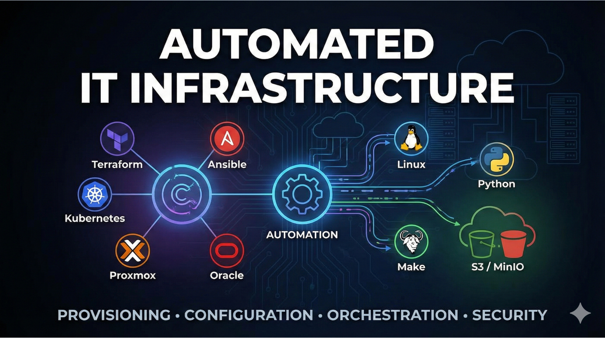

# Automated IT Infrastructure

[](LICENSE)
[](https://www.ansible.com/)
[](https://www.terraform.io/)
[](https://kubernetes.io/)
[](https://www.proxmox.com/)
[](https://www.kernel.org/)
[](https://www.python.org/)
[](https://www.gnu.org/software/make/)
[](https://www.oracle.com/database/)
[](https://aws.amazon.com/s3/)
[](https://min.io/)

## Overview

Environment-aware infrastructure automation platform for Proxmox-based homelab operations, combining Terraform, Packer, Vault, and Ansible in a single monorepo

---



---

## Monorepo Layout

- `terraform-proxmox/`: VM provisioning, Vault integration, Packer image builds.
- `inventories/`: centralized generated inventory plus alias group mappings.
- `ansible/bootstrap_playbooks/`: app/db bootstrap playbooks (Oracle DB, WebLogic, Zabbix, and future services).
- `ansible/user-man/`: Linux account CRUD plus hardening.
- `ansible/time_sync/`: Chrony/NTP synchronization role.

## Tracked Environment Model

- `terraform-proxmox/environments/dev.tfvars` is the only committed environment seed.
- The tracked `dev` scaffold is the canonical 18-node bootstrap model:
  - `public-weblogic14c-01`
  - `public-weblogic12c-01`
  - `public-database19c-01`
  - `public-database19c-ol9-01`
  - `public-database21c-01`
  - `public-zabbix-01`
  - `public-freeipa-01`
  - `public-keycloak-01`
  - `public-observability-01`
  - `public-zimbra-01`
  - `public-k8s-cp-01`
  - `public-k8s-worker-01`
  - `public-k8s-worker-02`
  - `public-k8s-etcd-01`
  - `public-jenkins-01`
  - `public-gitlab-01`
  - `public-jenkins-agent-01`
  - `public-gitlab-runner-01`
- Other environments should copy that service layout, then change only environment-specific values such as IPs, storage pools, and Vault CIDR bounds.
- The committed `inventories/example/inventory.ini` is generated output and can lag `dev.tfvars`; validate and regenerate it through a reviewed Terraform apply before using newly added groups.

## Standard Entry Points

- Terraform/Packer workflow: run from `terraform-proxmox/` via `make` targets.
- Ansible project entrypoints:
  - `ansible/bootstrap_playbooks/oracle819c/main.yml`
  - `ansible/bootstrap_playbooks/oracle919c/main.yml`
  - `ansible/bootstrap_playbooks/oracle821c/main.yml`
  - `ansible/bootstrap_playbooks/oracle_weblogic12c/main.yml`
  - `ansible/bootstrap_playbooks/oracle_weblogic14c/main.yml`
  - `ansible/bootstrap_playbooks/freeipa/main.yml`
  - `ansible/bootstrap_playbooks/keycloak/main.yml`
  - `ansible/bootstrap_playbooks/observability/main.yml`
  - `ansible/bootstrap_playbooks/zimbra/main.yml`
  - `ansible/bootstrap_playbooks/jenkins/main.yml`
  - `ansible/bootstrap_playbooks/gitlab/main.yml`
  - `ansible/user-man/main.yml`
  - `ansible/time_sync/main.yml`
  - `ansible/bootstrap_playbooks/zabbix_server/main.yml`

## Inventory Convention

- Central inventory path pattern: `inventories/<env>/inventory.ini` plus `inventories/aliases.ini`.
- `dev` is the only tracked environment and is the template for new generated environments.
- Project-local `ansible.cfg` files may be pointed at a generated local environment to keep commands short; for portable docs and automation, use explicit `-i inventories/<env>/inventory.ini -i inventories/aliases.ini`.
- `inventories/aliases.ini` also carries repo-wide helper groups such as `ntp_clients`, which should include Kerberos-sensitive service hosts like FreeIPA, Keycloak, and observability nodes in addition to Oracle/WebLogic clients.
- Validate inventory wiring with:
  - `ansible-inventory -i inventories/<env>/inventory.ini -i inventories/aliases.ini --graph`

## Ansible Vault

- Playbooks that consume encrypted variables require a vault password at runtime.
- Project `ansible.cfg` files point at the ignored local `ansible/.vault_password` file. The password file itself is **not** committed; operators can provide it via one of:
  - `export ANSIBLE_VAULT_PASSWORD_FILE=ansible/.vault_password` (a `.vault_password` file under the `ansible/` directory is gitignored for convenience).
  - `--vault-password-file <path>` on the CLI.
  - `--ask-vault-pass` for interactive entry.
- Never commit vault passwords, tokens, or private keys to the repository.

## Python Environment Convention (pyenv)

All Ansible automation uses the repository-wide pyenv virtualenv declared in `ansible/.python-version`:

- Control-node pyenv virtualenv: `v3.13.14`
- Python packages: `ansible/requirements.txt`
- Ansible collections: `ansible/requirements.yml`

Setup example:

```bash
cd ~/IaC-Homelab/ansible
pyenv install -s 3.13.14
pyenv virtualenv 3.13.14 v3.13.14
pyenv local v3.13.14
python -m pip install --upgrade pip
pip install -r requirements.txt
ansible-galaxy collection install -r requirements.yml
```

## 1. Ansible-Based Linux User Management Automation

### Features

- User creation and modification with custom UIDs, groups, and SSH keys.
- User removal including home directories.
- Group management with OS-aware mappings.
- SSH key management for generation, export, and rotation.
- Password policy enforcement and account controls.
- Key-only account hardening for automation users.
- SSH allowlist enforcement for managed identities.
- Unmanaged account baseline enforcement.
- Password history enforcement with PAM integration.
- Multi-OS support for RHEL, CentOS, Ubuntu, and SUSE.

### Advantages

- Centralized access management across Linux hosts.
- Security best practices enforced consistently.
- Reduced risk of account drift and orphaned users.
- Faster onboarding and offboarding operations.

---

## 2. Oracle WebLogic 12c Automation (OL8)

### Features

- Full stack setup for JDK 8, Fusion Middleware, and WebLogic Server.
- Automated RCU schema creation.
- Automated WebLogic domain configuration.
- Managed server automation toggle via `managed_server_enable`.
- Optional additional domain handling via `additional_weblogic_domains`.
- Systemd service integration.
- OS tuning for kernel and ulimits.
- Scheduled restart support via cron.
- Structured logs for operations and troubleshooting.

### Advantages

- Lower manual setup effort and error rate.
- Consistent configuration across environments.
- Simplified lifecycle management and upgrades.
- Supports EOL mitigation by moving OL7 workloads to OL8.

---

### WebLogic Runtime Notes (12c and 14c)

- Admin Console is served on AdminServer ports only.
  - 12c examples: `8006` (primary), `8106` (additional domain admin).
  - 14c example: `7001`.
- Managed server `/console` URLs returning HTTP `404` are expected behavior.
  - Examples: `:8001/console`, `:8002/console`, `:8101/console`.
- `managed_server_enable` controls managed-server service/script automation independently from admin-domain setup.
- CRUD/idempotency validation is a two-pass run (`ansible-playbook` twice) with `failed=0` and `unreachable=0` on pass 2.

---

## 3. Oracle 19c Database Automation (OL8)

### Features

- Pre-installation checks for host prerequisites.
- Silent Oracle installation flow.
- Automated DB creation via DBCA.
- Listener and network configuration automation.
- Environment script management for DB operations.

### Advantages

- Reduced deployment time and manual steps.
- Standardized DB setup across hosts.
- Repeatable environment builds for dev/staging.
- Better auditability and operational consistency.

---

## 4. Proxmox Cloud-Init Template Automation (Bash + Ansible)

### Features

- Base image download and initialization.
- Proxmox VM template creation.
- Checksum-verified cloud image sync for `ubuntu22`, `ubuntu24`, `debian12`, `oracle8`, `oracle9`, `rocky9`, `alma9`, and `fedora43`.
- Zabbix agent pre-install support.
- System update and SSH hardening baseline.
- DNS and hostname initialization in templates.
- Cross-distro first-boot validation for root-disk, data-disk, and swap flows before expanding the template matrix.

### Advantages

- Faster VM provisioning from known-good images.
- Consistent security and monitoring baseline at first boot.
- Reduced image drift.
- Better disaster recovery and scale-out readiness.

---

## 5. Terraform-Based Proxmox VM Provisioning

### Features

- Makefile-driven workflow for init/plan/apply/destroy operations.
- Multi-environment support with Terraform workspaces.
- Vault-backed Proxmox API credential handling with configurable KV mount/prefix paths.
- Per-VM customization of compute, storage, network, and tagging.
- Reusable module-based VM provisioning model.
- Built-in Vault bootstrap flow for AppRole and governance resource reconciliation.
- Supports token-based governance workflows and AppRole runtime secret access patterns.

### Advantages

- Reproducible infrastructure through code.
- Faster full-environment provisioning.
- Less dependence on manual Proxmox UI steps.
- Better change tracking and auditability.
- Improved secret management posture via Vault.

---

## 6. Kubernetes Cluster Automation with Kubespray

### Tracked Cluster Topology (`dev`)

| Role | VM Name | Cores | RAM | Disk |
| --- | --- | --- | --- | --- |
| Control Plane | `public-k8s-cp-01` | 4 | 4 GB | 50 GB |
| Worker Node 1 | `public-k8s-worker-01` | 2 | 4 GB | 50 GB |
| Worker Node 2 | `public-k8s-worker-02` | 2 | 4 GB | 50 GB |
| Dedicated etcd | `public-k8s-etcd-01` | 2 | 4 GB | 50 GB |

- **Kubespray checkout**: external at `/home/example/kubespray` by default; the repository does not pin its version
- **Inventory**: repository-generated `inventories/<env>/inventory.ini` plus `inventories/aliases.ini`
- **OS**: Ubuntu 24.04 (cloud-init template `ubuntu2404`)
- **Network plugin**: Calico (kubespray default)
- **Container runtime**: containerd (kubespray default)
- **etcd topology**: Unstacked (dedicated etcd VM)

### Features

- Automated Kubernetes deployment using Kubespray.
- Dedicated etcd topology through the `k8s_etcd` Terraform group and inventory alias.
- Cloud-init-based node bootstrap integration with Terraform-provisioned VMs.
- Environment-specific inventory and group_vars configuration.
- Support for scaling workers by adding entries to `terraform-proxmox/environments/<env>.tfvars` and regenerating inventory.

### Topology Changes

The current topology already separates the control plane and etcd. Additional control-plane or etcd members require coordinated Terraform, inventory, and external Kubespray lifecycle changes.

To achieve this:

1. **Provision VMs**: Add uniquely named/numbered nodes to the matching `k8s_control_plane`, `k8s_etcd`, or `k8s_workers` Terraform group.
2. **Regenerate inventory**: Apply the reviewed Terraform plan and verify `inventories/aliases.ini` maps the primitive groups to Kubespray groups.

Do not hand-edit the generated Kubespray groups. `inventories/aliases.ini` maps the Terraform groups into `kube_control_plane`, `etcd`, and `kube_node`.

### Deployment Steps

1. Provision VMs via Terraform (`make apply ENVIRONMENT=<env>` from `terraform-proxmox/`).
2. Boot the K8S VMs from Proxmox (they are created in `stopped` state).
3. Validate the generated inventory:

   ```bash
   ansible-inventory -i inventories/<env>/inventory.ini -i inventories/aliases.ini --graph
   ```

4. Verify SSH connectivity:

   ```bash
   ansible -i inventories/<env>/inventory.ini -i inventories/aliases.ini -m ping k8s_cluster -u ansible
   ```

5. Deploy the cluster:

   ```bash
   cd terraform-proxmox
   make k8s-deploy ENVIRONMENT=<env> KUBESPRAY_DIR="$HOME/kubespray"
   ```

   The target creates or reuses `KUBESPRAY_DIR/venv` and installs Kubespray's
   requirements there. This keeps the repository's pinned Ansible environment
   unchanged. Override `KUBESPRAY_PYTHON` or `KUBESPRAY_VENV` when the default
   Python 3.13.14 path or external checkout layout differs.

### Lifecycle Commands

| Operation | Command |
| --- | --- |
| Initial/full convergence | `make k8s-deploy ENVIRONMENT=<env> KUBESPRAY_DIR="$HOME/kubespray"` from `terraform-proxmox/` |
| Scale, remove, upgrade, reset | Use the procedure for the externally selected Kubespray release; no repository wrapper target is defined |

### Advantages

- Faster Kubernetes rollout in complex environments.
- Consistent cluster topology across stages.
- Reduced manual error during bootstrap and expansion.
- Extensible platform for future observability and add-ons.

---

## 7. Security and Hardening Integration

### Features

- SSH key authentication baseline.
- Role-based access controls by host/group context.
- Password aging, account lock, sudo control, and password history enforcement.
- Infrastructure segmentation using host tags.
- Retained Terraform and Ansible logs for compliance trails.
- Baseline controls for unmanaged interactive Linux accounts.

### Advantages

- Security controls integrated from day one.
- Lower compliance and audit risk.
- Reduced security drift across environments.
- Alignment with DevSecOps operating patterns.

---

## 8. Scalability and Disaster Recovery

### Features

- Immutable-style rebuild capability for environments.
- State-driven change tracking and rollback support.
- Backup-aware infrastructure workflows.
- Templated network and hostname patterns.

### Advantages

- Faster recovery with reproducible configuration state.
- Easier horizontal growth.
- Simplified disaster recovery operations.

---

## 9. Public Mirror Automation

- GitHub visibility is repository-wide; branches cannot be private inside a public repository.
- This project includes a sanitize-and-publish workflow to mirror selected private branches into a public repository:
  - Workflow: `.github/workflows/public-mirror.yml`
  - Scripts: `scripts/public-release/`
  - Rules: `.github/sanitize/`
- Supported source branches:
  - `main`
  - `develop`
  - `terraform-proxmox-automated-infra`
- Configure these in the private source repo:
  - Variable: `PUBLIC_MIRROR_REPO` (format: `owner/repo`)
  - Variable: `PUBLIC_MIRROR_APP_ID` (GitHub App ID used for mirror publishing)
  - Secret: `PUBLIC_MIRROR_APP_PRIVATE_KEY` (GitHub App private key PEM)

---

## Summary

| Automation Area | Key Value Delivered |
| --- | --- |
| User and Group Management | Secure and unified access across systems |
| Oracle Stack Automation | Faster and more repeatable app/DB environment setup |
| VM Template Automation | Baseline consistency and security from first boot |
| Terraform Infra Provisioning | IaC with fast and predictable environment spin-up |
| Kubernetes Bootstrapping | Production-grade orchestration setup at scale |
| Security Automation | Security-by-default with reduced manual dependency |
| DR and Scalability Support | Confidence in rebuilds, migrations, and growth |

---

## Project Documentation

- `ansible/bootstrap_playbooks/README.md`
- `ansible/bootstrap_playbooks/freeipa/README.md`
- `ansible/bootstrap_playbooks/keycloak/README.md`
- `ansible/bootstrap_playbooks/observability/README.md`
- `terraform-proxmox/README.md`
- `ansible/bootstrap_playbooks/oracle819c/README.md`
- `ansible/bootstrap_playbooks/oracle821c/README.md`
- `ansible/bootstrap_playbooks/oracle_weblogic12c/README.md`
- `ansible/bootstrap_playbooks/oracle_weblogic14c/README.md`
- `ansible/bootstrap_playbooks/zabbix_server/README.md`
- `ansible/bootstrap_playbooks/zimbra/README.md`
- `ansible/user-man/README.md`
- `ansible/time_sync/README.md`
- `inventories/README.md`
- `docs/oracle-db-weblogic-crud-scenario.md`
- `docs/public-mirror.md`
