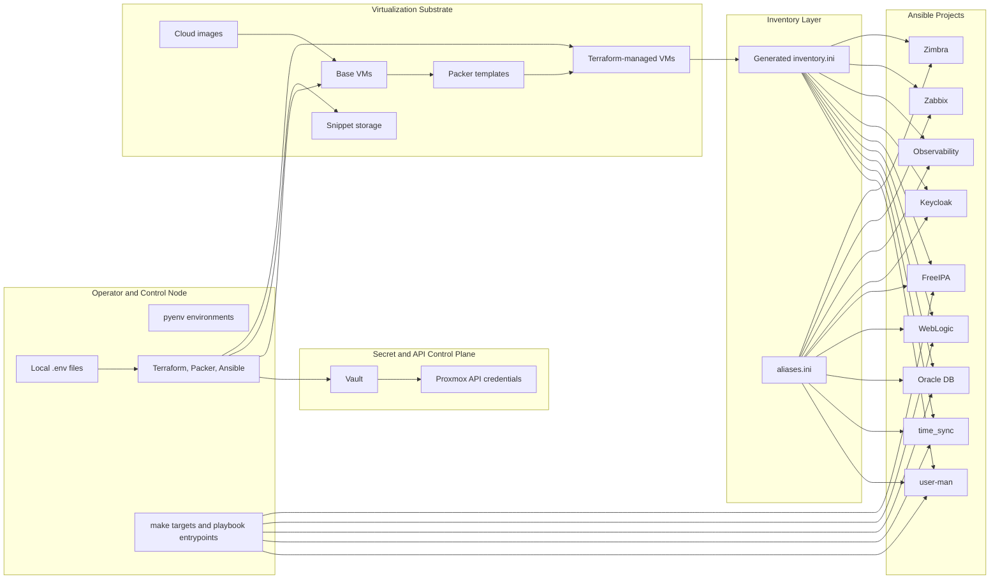

# Platform Architecture

## Primary Sources

- [README.md](../../README.md)
- [terraform-proxmox/Makefile](../../terraform-proxmox/Makefile)
- [terraform-proxmox/main.tf](../../terraform-proxmox/main.tf)
- [terraform-proxmox/templates/inventory.tpl](../../terraform-proxmox/templates/inventory.tpl)
- [inventories/aliases.ini](../../inventories/aliases.ini)
- [ansible/bootstrap_playbooks/README.md](../../ansible/bootstrap_playbooks/README.md)
- [ansible/user-man/README.md](../../ansible/user-man/README.md)
- [ansible/time_sync/README.md](../../ansible/time_sync/README.md)

## What This Repo Is

This monorepo is a layered automation platform with distinct ownership boundaries:

- `terraform-proxmox/` defines infrastructure state, workspace-aware environment scaffolding, snippet rendering, inventory generation, and Packer entrypoints.
- `inventories/` is the bridge between Terraform output and Ansible targeting.
- `ansible/bootstrap_playbooks/` holds service-specific automation for databases, middleware, identity, monitoring, and mail.
- `ansible/user-man/` and `ansible/time_sync/` are cross-cutting host baselines that sit underneath the service playbooks.
- The root and per-project READMEs explain operator entrypoints and conventions, while the Makefile and playbook `main.yml` files encode the executable flow.

## Layer Model

| Layer | Main repo locations | What it owns |
| --- | --- | --- |
| Operator and controller | `README.md`, per-project `.python-version`, `requirements*.txt` | local toolchain, pyenv runtime, local `.env` inputs |
| Secret and infrastructure control plane | `terraform-proxmox/`, Vault helper scripts | Vault auth, Proxmox API access, Terraform workspaces, Packer vars |
| Image and template substrate | `terraform-proxmox/scripts/`, `terraform-proxmox/packer/` | cloud images, base VMs, clone-based templates |
| Environment state model | `terraform-proxmox/environments/*.tfvars`, `terraform-proxmox/main.tf` | node groups, OS profiles, tags, networking, disks, snippets |
| Inventory bridge | `terraform-proxmox/templates/inventory.tpl`, `inventories/aliases.ini` | generated host map plus stable semantic groups |
| Host enablement | `ansible/user-man/`, `ansible/time_sync/` | account access, SSH baseline, sudo posture, Chrony baseline |
| Service bootstrap | `ansible/bootstrap_playbooks/*` | app, DB, identity, monitoring, and mail installation/configuration |
| Execution and verification | `terraform-proxmox/Makefile`, playbook `main.yml`, role `validate.yml` and `verify.yml` files | guardrails, prechecks, workflow entrypoints, generated logs and summaries |

## Architecture Diagram

## The Environment Model

`terraform-proxmox/main.tf` is the environment compiler. It flattens `node_groups`, resolves OS profiles, derives partitioning snippet paths, and emits inventory lines.

The result is:

- one Terraform workspace per environment
- one generated `inventories/<env>/inventory.ini`
- one static `inventories/aliases.ini` that maps logical playbook groups such as `oracle_servers`, `weblogic_servers`, `zimbra_servers`, `ntp_clients`, and `freeipa_clients`

The generated inventory carries:

- `ansible_user=ansible`
- `ansible_become=yes`
- environment tags
- an `[all_nodes]` group
- one group per Terraform `node_groups` key

That makes `inventory.ini` the runtime host map and `aliases.ini` the semantic grouping layer used by playbooks.

## Why Inventory Aliases Matter

The alias file is what allows:

- `oracle819c` and `oracle821c` to target `oracle_servers` children
- `time_sync` to define `ntp_servers` and `ntp_clients`
- `user-man` to deliberately target `all_nodes` and avoid alias-only controller hosts
- service projects to remain stable even if Terraform group composition changes

Without `aliases.ini`, the repo would have tightly coupled playbooks and environment-specific host names.

## Two Useful Ways to Read the Repo

1. Infrastructure path:
   environment tfvars -> base VMs -> Packer templates -> Terraform apply -> generated inventory.

2. Automation path:
   generated inventory + alias groups -> host enablement -> service playbooks -> role-level verification.

Both are valid views of the same codebase. The first explains how machines appear. The second explains how those machines become usable services.

## Architectural Limits of the Current Docs

The tracked files do not fully define:

- a full VLAN architecture
- HA cluster behavior for every service
- detailed capacity planning math
- one global orchestration script that drives every project

Those topics belong either in future work or in service-specific docs when the codebase grows them.
