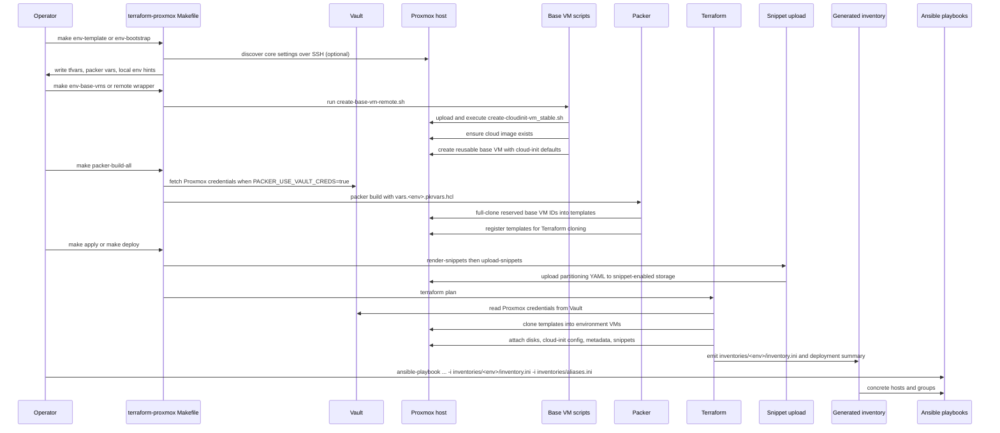

# Provisioning Pipeline

## Primary Sources

- [terraform-proxmox/README.md](../../terraform-proxmox/README.md)
- [terraform-proxmox/Makefile](../../terraform-proxmox/Makefile)
- [terraform-proxmox/main.tf](../../terraform-proxmox/main.tf)
- [terraform-proxmox/environments/dev.tfvars](../../terraform-proxmox/environments/dev.tfvars)
- [terraform-proxmox/scripts/create-cloudinit-vm_stable.sh](../../terraform-proxmox/scripts/create-cloudinit-vm_stable.sh)
- [terraform-proxmox/scripts/create-base-vm-remote.sh](../../terraform-proxmox/scripts/create-base-vm-remote.sh)
- [terraform-proxmox/scripts/scaffold-env.sh](../../terraform-proxmox/scripts/scaffold-env.sh)
- [terraform-proxmox/scripts/upload-snippets.sh](../../terraform-proxmox/scripts/upload-snippets.sh)
- [terraform-proxmox/packer/ubuntu-noble/ubuntu-noble.pkr.hcl](../../terraform-proxmox/packer/ubuntu-noble/ubuntu-noble.pkr.hcl)
- [terraform-proxmox/packer/oracle8/oracle8.pkr.hcl](../../terraform-proxmox/packer/oracle8/oracle8.pkr.hcl)

## Pipeline Overview

The repo supports two related infrastructure flows:

- scaffold or adjust an environment definition
- build or refresh the substrate needed to deploy that environment

The minimum substrate sequence is:

1. define environment inputs
2. create or refresh reusable base VMs
3. build Packer templates from those base VMs
4. render and upload partitioning snippets
5. run Terraform apply
6. consume the generated inventory from Ansible

## End-to-End Sequence

## Stage 1: Environment Scaffolding

`terraform-proxmox/scripts/scaffold-env.sh` is the repo helper for creating a new environment from an existing template, typically `dev`.

What it handles:

- copies and rewrites `environments/<env>.tfvars`
- prepares matching Packer vars files
- can auto-discover Proxmox node, bridge, storage, and route-adjacent settings
- preserves a reserved VMID policy for base VMs and template VMs

The script hardcodes reserved IDs and names for reusable assets:

- base VMs
  - Oracle 9: `999999990`
  - Oracle 8: `999999991`
  - Ubuntu 24.04: `999999992`
- templates
  - Oracle 9: `999999993`
  - Oracle 8: `999999994`
  - Ubuntu 24.04: `999999995`

This separation matters: base VMs are the input to Packer, while templates are the output used by Terraform.

## Stage 2: Base VM Creation

The lowest-level VM bootstrap script is `terraform-proxmox/scripts/create-cloudinit-vm_stable.sh`.

What the script handles:

- creating Proxmox cloud-init VMs for multiple OS families via `--os`
- reading local script-directory `.env` values for secrets and controller-side defaults
- auto-deriving names and validating VM, disk, network, filesystem, and partition options
- installing a baseline package set that includes Python, Chrony, disk tooling, and NFS support

The remote wrapper `create-base-vm-remote.sh` adds:

- SSH delivery to a Proxmox host
- auto-download of common cloud images when missing
- pass-through of environment variables such as `VMID`, `NAME`, and `OS_TYPE`
- remote execution on the actual Proxmox node rather than the operator workstation

This is the point where the repo turns cloud images into reusable base assets for later cloning.

## Stage 3: Packer Template Builds

The Makefile exposes:

- `packer-build`
- `packer-build-all`
- `packer-build-ubuntu2404`
- `packer-build-oracle8`
- `packer-build-oracle9`

The Packer templates in this repo use the `proxmox-clone` builder and `communicator = "none"`.

That means:

- Packer is not configuring guest internals over SSH
- it is cloning a prepared base VM into a reusable template VM
- the template stage standardizes the Proxmox-side source image for later Terraform cloning

The Oracle 8 and Ubuntu 24.04 Packer templates both show:

- Proxmox API URL/token inputs
- target node input
- template VM ID distinct from the base clone VM ID
- full clone enabled
- `qemu_agent = true`
- `virtio-scsi-single` controller
- `vmbr0` bridge and `virtio` NIC model

## Stage 4: Terraform Environment Modeling

`terraform-proxmox/main.tf` is the environment compiler.

Important behaviors visible in the root module:

- environment name comes from workspace with fallback behavior for `default`
- node groups are flattened into a VM map
- OS profiles are inferred from group names unless explicitly overridden
- additional data disks and partitioning snippets are derived from VM config
- inventory lines are generated directly from Terraform locals
- Proxmox credentials are read from Vault using `ephemeral "vault_kv_secret_v2"`

The committed `environments/dev.tfvars` shows the intended modeling style:

- environment metadata such as cluster and owner tags
- Proxmox node, storage pool, bridge, snippet storage
- Vault auth mode and governance toggles
- default cloud-init access user
- `node_groups` for WebLogic, Oracle databases, Zabbix, FreeIPA, Keycloak, observability, Zimbra, Jenkins, GitLab, and Kubernetes control-plane/etcd/worker nodes
- per-VM CPU, memory, root disk size, data disk size, and partition definitions

## Stage 5: Snippet Rendering and Upload

Partitioning snippets are a first-class Terraform input path in this repo.

The Makefile shows:

- `render-snippets`
- `upload-snippets`
- `snippets` as the combined target

The `apply` target calls `snippets` before planning and applying.

`upload-snippets.sh` shows several important implementation details:

- snippet upload is environment-aware
- snippet storage must actually support `content snippets`
- the Proxmox host can be resolved from multiple sources
- uploaded files land in the Proxmox storage path returned by `pvesm path`

That means snippet upload is part of normal environment compilation whenever partition-driven guest setup is enabled.

## Stage 6: Apply, Inventory, and Summary Generation

The Makefile `apply` target does this in order:

1. `make snippets`
2. `make plan`
3. `terraform apply <plan>`
4. `make generate-inventory`

The `deploy` target wraps a bigger workflow:

- `fmt`
- `init`
- `validate`
- `workspace-create`
- `workspace-select`
- `plan`
- `apply`

`generate-inventory` does not build the inventory from scratch itself. Instead, it:

- confirms the Terraform-generated inventory file exists
- ensures the inventory directory exists
- relocates the deployment summary into `summaries/` when present

So the inventory is generated by Terraform output and then surfaced by the Makefile as a shared Ansible entrypoint.
