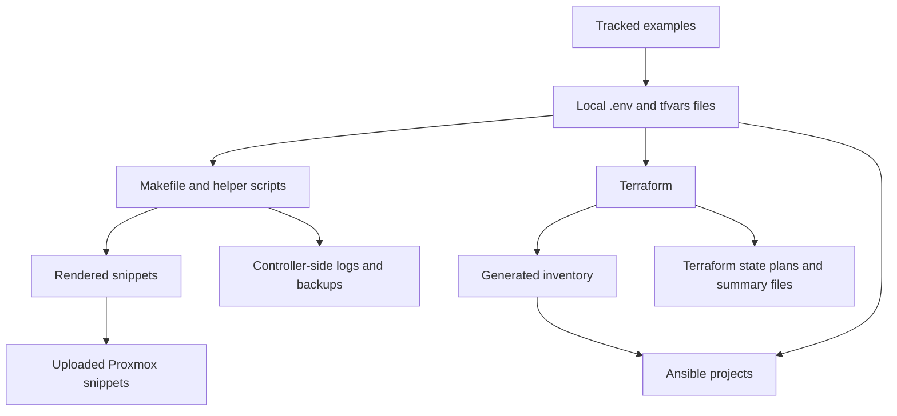

# Environment Inputs and Generated Outputs

## Primary Sources

- [.gitignore](../../.gitignore)
- [README.md](../../README.md)
- [terraform-proxmox/.env.example](../../terraform-proxmox/.env.example)
- [terraform-proxmox/secrets.auto.tfvars.example](../../terraform-proxmox/secrets.auto.tfvars.example)
- [terraform-proxmox/README.md](../../terraform-proxmox/README.md)
- [terraform-proxmox/Makefile](../../terraform-proxmox/Makefile)
- [terraform-proxmox/scripts/upload-snippets.sh](../../terraform-proxmox/scripts/upload-snippets.sh)
- [inventories/README.md](../../inventories/README.md)
- [ansible/user-man/README.md](../../ansible/user-man/README.md)
- [ansible/time_sync/README.md](../../ansible/time_sync/README.md)

## Why This Chapter Exists

This repository depends on a mix of committed examples, local-only operator inputs, and generated outputs. Without documenting those layers clearly, it is easy to confuse source files with throwaway artifacts.

The repo is opinionated about:

- what must stay local
- what is generated
- what should be copied from examples
- what has precedence when the same value appears in multiple places

## Operator Runtime Prerequisites

The root README defines one repository-wide pyenv environment for Ansible automation:

| Scope | Path/value |
| --- | --- |
| pyenv virtualenv | `v3.13.14` |
| pyenv marker | `ansible/.python-version` |
| Python packages | `ansible/requirements.txt` |
| Ansible collections | `ansible/requirements.yml` |

This is operational, not cosmetic. The repo expects Ansible work to use the same controller interpreter and dependency set across service, host-baseline, and database playbooks.

## Local Inputs vs. Generated Outputs

| Category | Examples | Producer | Consumer |
| --- | --- | --- | --- |
| Tracked examples | `.env.example`, `secrets.auto.tfvars.example`, `vars.example.pkrvars.hcl`, committed READMEs | repo | operator |
| Local secrets and overrides | `.env`, `.vault_password`, `secrets.auto.tfvars`, project-local `.env` files | operator | Makefile, Terraform, Ansible |
| Environment definitions | `environments/<env>.tfvars`, `packer/*/vars.<env>.pkrvars.hcl` | operator or scaffold scripts | Terraform, Packer |
| Terraform runtime state | `.terraform/`, `*.tfstate`, lock files, plans | Terraform | Terraform, backup workflow |
| Generated inventories | `inventories/<env>/inventory.ini` | Terraform | all Ansible projects |
| Generated summaries | `summaries/deployment-summary-<env>.json` | Terraform apply | operators and downstream docs |
| Generated logs and backups | `logs/`, `backups/`, `plans/` under `terraform-proxmox/` | Makefile targets | operators |
| Rendered snippet source | `snippets/*.yaml` | `render-snippets` | `upload-snippets`, cloud-init guest setup |

## What the Root `.gitignore` Encodes

The root ignore policy excludes:

- Terraform state and lock artifacts
- `*.tfvars` and `*.tfvars.json`
- `.env` and `.env.*` except tracked example files
- `.vault_password`
- local scratch and transient outputs

That matches the repo model:

- secrets and mutable environment values stay local
- generated plans, inventories, and logs are disposable
- example files and READMEs are the committed onboarding layer

## Config Precedence That Matters

The Terraform README documents an especially important rule:

- `secrets.auto.tfvars` has higher precedence than `TF_VAR_*` environment variables

That matters because stale `vault_token` values in `secrets.auto.tfvars` can silently override a newer token exported via `.env` or shell variables.

The same README also documents two auth patterns:

- token mode, especially when governance management is enabled
- AppRole mode for day-to-day secret reads

Those are not interchangeable. They change which helper targets and Terraform flows can succeed.

## Project-Local `.env` Loading Is Distributed

There is no single repo-wide `.env` loader for every playbook. Instead, several projects read optional `.env` files from their own playbook directory inside `pre_tasks`.

Current examples include:

- `ansible/time_sync/`
- `ansible/bootstrap_playbooks/freeipa/`
- `ansible/bootstrap_playbooks/keycloak/`
- `ansible/bootstrap_playbooks/observability/`
- `ansible/bootstrap_playbooks/oracle819c/`
- `ansible/bootstrap_playbooks/oracle821c/`
- `ansible/bootstrap_playbooks/oracle_weblogic12c/`
- `ansible/bootstrap_playbooks/oracle_weblogic14c/`

That means precedence is partly repo-wide and partly project-local. When debugging a value, check the project entrypoint as well as the shared Terraform docs.

## Proxmox Host Resolution Is Layered

`terraform-proxmox/scripts/upload-snippets.sh` and the Makefile show a concrete resolution chain for `PROXMOX_HOST`:

1. explicit `PROXMOX_HOST`
2. `.env` value
3. environment-specific `.env` key such as `PROXMOX_HOST_DEV`
4. Vault secret lookup for `proxmox_config_api_url`
5. Packer vars files

This is the kind of repo behavior that is easy to miss if you only read the top-level README.

## Inventory as a Generated Artifact

The inventories README is explicit:

- `inventories/<env>/inventory.ini` is generated by Terraform
- `inventories/aliases.ini` is the static semantic overlay
- `all_nodes` should be used when a playbook must touch only Terraform-managed VMs

That distinction is operationally important:

- `user-man` intentionally targets `all_nodes`
- `time_sync` intentionally includes `ansible-control-node` in `ntp_servers`
- app-specific playbooks use alias groups such as `oracle_servers`, `zimbra_servers`, and `freeipa_servers`

## Secret and Artifact Flow

## Practical Rules for Operators

- Copy tracked example files before inventing local ones.
- Treat `.env`, `*.tfvars`, and `.vault_password` as local interfaces, not as long-term documentation.
- Expect generated inventory to be disposable and reproducible.
- Check `secrets.auto.tfvars` before assuming exported environment variables are winning.
- When a playbook behaves differently than expected, inspect its `pre_tasks` for local `.env` parsing and assertions.

## What This Chapter Does Not Claim

It does not claim the repo has:

- one universal precedence model for every project
- a centralized secret abstraction for every playbook
- a single source of truth for every setting outside the Terraform domain

Instead, it documents the actual mix of:

- root-level conventions
- project-local conventions
- helper-script-specific resolution behavior
