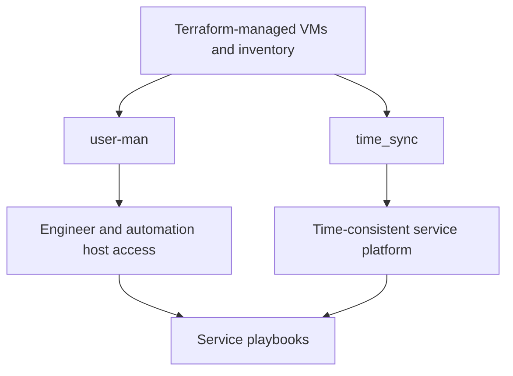

# Host Enablement

## Primary Sources

- [ansible/user-man/README.md](../../ansible/user-man/README.md)
- [ansible/user-man/main.yml](../../ansible/user-man/main.yml)
- [ansible/time_sync/README.md](../../ansible/time_sync/README.md)
- [ansible/time_sync/main.yml](../../ansible/time_sync/main.yml)
- [inventories/aliases.ini](../../inventories/aliases.ini)
- [ansible/bootstrap_playbooks/README.md](../../ansible/bootstrap_playbooks/README.md)

## Why Host Enablement Is Its Own Layer

This repo has two playbook families that are easy to underestimate:

- `user-man`
- `time_sync`

They are not optional extras. They make the environment usable and predictable for the rest of the platform.

In practical terms:

- `user-man` turns provisioned VMs into hosts that engineers and automation can actually access and administer.
- `time_sync` turns a set of VMs into a time-consistent environment that can support identity and service-to-service assumptions.

## `user-man`: Access, Baseline, and Operator Usability

The `user-man` README and `main.yml` make several facts explicit:

- the playbook targets `all_nodes`
- this deliberately excludes alias-only hosts such as `ansible-control-node`
- it manages creation, update, cleanup, password policy, SSH key posture, password history, and automation-account hardening
- it asserts `ansible-core >= 2.17`
- it asserts Python 3.9+ on managed hosts

To ensure technical users can actually use the environment after provisioning, `user-man` reconciles Linux accounts, SSH keys, sudo posture, and account policy on the Terraform-managed hosts.

### What `user-man` actually covers

From its README and task layout, the role family includes:

- group creation and OS-specific admin group mapping
- user create and update flows
- user cleanup and offboarding
- automation account hardening
- unmanaged interactive account baseline enforcement
- PAM password history enforcement
- SSH login allowlist enforcement

It also expects local handling of Vault password material:

- `.vault_password` is intentionally untracked
- encrypted vars are loaded via `group_vars/secret_vars.yml`

## `time_sync`: Repo-Wide Chrony Baseline

The `time_sync` README and `main.yml` define an internal server/client NTP topology:

- `ntp_servers` contains the Ansible control node
- `ntp_clients` contains service hosts that should sync from those internal servers
- the playbook bootstraps Python 3 on targets when needed
- facts are gathered after Python bootstrap, not before

The alias file confirms the repo-wide grouping model:

- `ansible-control-node` is in `ntp_servers`
- `oracle_servers`, `weblogic_servers`, `freeipa_servers`, `keycloak_servers`, `observability_servers`, and `zimbra` are in `ntp_clients`

The bootstrap playbooks README adds the operational rule:

- run `ansible/time_sync/main.yml` before `freeipa`
- also run it before Kerberos-sensitive or identity-adjacent service stacks such as Keycloak and observability

This means time sync is part of the platform baseline, not a post-config cleanup step.

### Client source resolution

The `time_sync` README documents the client source selection order:

1. `time_sync_client_ntp_servers`
2. hosts from `ntp_servers`, resolved via
   `time_sync_server_advertise_ip` -> `ansible_host` -> `ansible_default_ipv4.address`
3. public fallback servers if enabled

That is the current repo model for how Chrony peers are chosen.

## How These Layers Relate to Service Playbooks

The repo does not currently have one root bootstrap script that enforces a single canonical order across every project. Instead, the relationship is expressed through:

- inventory design
- alias groups
- per-project README guidance
- service-specific preconditions

The current documented operating pattern is:

1. apply the access baseline with `user-man`
2. apply the time baseline with `time_sync`
3. run database or identity prerequisites
4. run dependent middleware and service playbooks

That is the codebase story the docs should tell, even when operators choose to execute the pieces manually.

## Dependency View

## Practical Documentation Rules for This Layer

- Treat `user-man` as an enablement layer, not only as a user CRUD chapter.
- Treat `time_sync` as a prerequisite layer, not only as a Chrony role.
- Call out `all_nodes` versus alias-group targeting.
- Call out that `ansible-control-node` exists for time-sync topology but is intentionally excluded from `user-man`.
- Describe ordering as repo guidance and dependency layering, not as a hardcoded global bootstrap script.

## What This Chapter Does Not Assume

This chapter does not assume:

- every environment is bootstrapped by the exact same manual sequence
- every service strictly depends on local user bootstrap to install
- every host participates in the time-sync topology in the same way

It only documents what the current codebase makes clear:

- these enablement layers exist
- they are central to operator usability
- later service playbooks are easier to reason about when these baselines are in place
