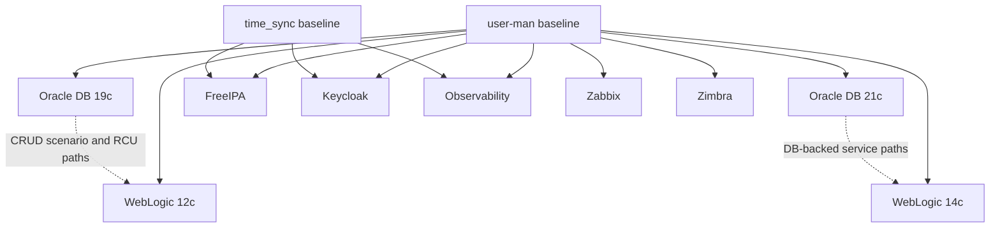

# Service Bootstrap

## Primary Sources

- [ansible/bootstrap_playbooks/README.md](../../ansible/bootstrap_playbooks/README.md)
- [ansible/bootstrap_playbooks/oracle819c/README.md](../../ansible/bootstrap_playbooks/oracle819c/README.md)
- [ansible/bootstrap_playbooks/oracle821c/README.md](../../ansible/bootstrap_playbooks/oracle821c/README.md)
- [ansible/bootstrap_playbooks/oracle_weblogic12c/README.md](../../ansible/bootstrap_playbooks/oracle_weblogic12c/README.md)
- [ansible/bootstrap_playbooks/oracle_weblogic14c/README.md](../../ansible/bootstrap_playbooks/oracle_weblogic14c/README.md)
- [ansible/bootstrap_playbooks/freeipa/README.md](../../ansible/bootstrap_playbooks/freeipa/README.md)
- [ansible/bootstrap_playbooks/keycloak/README.md](../../ansible/bootstrap_playbooks/keycloak/README.md)
- [ansible/bootstrap_playbooks/observability/README.md](../../ansible/bootstrap_playbooks/observability/README.md)
- [ansible/bootstrap_playbooks/zabbix_server/README.md](../../ansible/bootstrap_playbooks/zabbix_server/README.md)
- [ansible/bootstrap_playbooks/zimbra/README.md](../../ansible/bootstrap_playbooks/zimbra/README.md)
- [docs/oracle-db-weblogic-crud-scenario.md](../../docs/oracle-db-weblogic-crud-scenario.md)

## How to Read This Chapter

This is a service map, not a replacement for the service READMEs. It summarizes:

- target groups
- main configuration roots
- prerequisites visible in tracked docs and playbooks
- implementation patterns that matter to operators

## Common Project Shape

Most service projects under `ansible/bootstrap_playbooks/` follow the same broad layout:

- `main.yml` as the playbook entrypoint
- `.env.example` for local operator input
- `ansible.cfg` pointing at the shared inventory model
- `group_vars/` for non-secret defaults and environment-specific overrides
- `roles/` for task decomposition
- `templates/` for rendered configuration and service files

Newer projects such as FreeIPA, Keycloak, Observability, Zabbix, and Zimbra also expose an explicit `validate` then `verify` pattern inside their role task trees.

## Service Matrix

| Service family | Target group | Platform hint | Main config roots | Key prerequisites or behaviors |
| --- | --- | --- | --- | --- |
| Oracle 19c | `database19c` | Oracle Linux 8 | host-specific desired state in `group_vars/oracle_servers.yml` plus `vars/main.yml` fallback | fixed `oracle` UID / `oinstall` GID, `DUMP_DIR` defaults under `/Backup-Share`, short PDB naming, listener cleanup |
| Oracle 21c | `database21c` | Oracle Linux 8 | same desired-state model as 19c | same identity and dump-dir assumptions, same short-service-name convention |
| WebLogic 12c | `weblogic12c` | Oracle Linux 8 | `vars/weblogic_vars.yml`, env group vars, local `.env` secrets | installer archives on the control node, mountpoint prechecks, optional managed servers, additional domains can be created and managed |
| WebLogic 14c | `weblogic14c` | Oracle Linux 9 style stack | `vars/weblogic_vars.yml`, env group vars | installer archives on the control node, JDK compatibility checks, additional domains are manage-existing only |
| FreeIPA | `freeipa_servers` | Oracle Linux 9 class | `.env` and group vars | run `time_sync` first, choose integrated DNS or external DNS mode |
| Keycloak | `keycloak_servers` | Ubuntu 24.04 | `.env`, group vars, role defaults | requires DB and admin passwords, supports local or remote DB admin patterns |
| Observability | `observability_servers` | Ubuntu 24.04 | `.env`, group vars | Docker-based LGTM stack and collector components |
| Zabbix | `zabbix_servers` | Ubuntu 24.04 or Oracle Linux 9 | `.env` plus group vars | internal or external PostgreSQL, service-plugin pattern, optional backups |
| Zimbra | `zimbra_servers` | Oracle Linux 9 | `.env`, role defaults | local installer tarball, mounted `/zimbra` storage by default, host/firewall preparation |

## Oracle Databases: Desired-State Infrastructure Inside Ansible

The Oracle 19c and 21c playbooks share the same model:

- host-level desired state is declared in `group_vars/oracle_servers.yml`
- fallback defaults exist in `vars/main.yml`
- the playbooks manage listeners, CDBs, PDBs, and optional app SQL bootstrap
- post-tasks can copy selected installer logs back to a controller-side artifact directory

Important operator-facing facts:

- the host key in `oracle_servers` must match `inventory_hostname`
- Oracle user and group identity are fixed at `54321`
- app SQL behavior is target-driven and uses marker files to avoid rerun unless forced
- short PDB service names are preserved by default through empty `db_domain`

The CRUD scenario document is part of the service story because it shows how these database playbooks are expected to handle add, update, delete, and reconcile cycles.

## WebLogic: Middleware with Two Distinct Automation Models

Both WebLogic projects assume installer payloads are present on the control node under `/resources`.

Shared operator facts:

- they use the repository-wide `v3.13.14` pyenv runtime
- they validate required passwords in `pre_tasks`
- they check control-node archives before attempting installation
- they use inline `assert` and `wait_for` checks rather than a separate role-level `verify.yml`
- they support managed-server automation and systemd integration
- admin console checks should target AdminServer ports

Important difference between the two projects:

- 12c can create and then manage additional domains
- 14c treats additional domains as manage-existing only

That distinction matters because the implementation is similar in shape but not symmetric in scope.

## Identity and SSO: FreeIPA and Keycloak

The repo-wide bootstrap note says:

- run `time_sync` before `freeipa`
- also run it before Kerberos-sensitive service playbooks such as Keycloak and observability

FreeIPA-specific current-state facts:

- it supports integrated DNS or external DNS mode
- external DNS mode still requires a complete zone for verification to pass
- the README documents required A, SRV, and URI records for external DNS

Keycloak-specific current-state facts:

- the playbook automates Keycloak on Ubuntu 24.04
- it manages local PostgreSQL by default
- it can target a remote DB when `KEYCLOAK_DB_HOST` is set appropriately
- it requires database and admin password inputs

The docs should present these as complementary identity-plane components without claiming tighter integration than the tracked files show.

## Observability, Zabbix, and Zimbra

### Observability

The observability playbook is Docker-based and deploys:

- Grafana
- Prometheus
- Loki
- Tempo
- OpenTelemetry Collector
- Node Exporter

Its role tree follows a clean `validate -> packages -> configure -> service -> verify` pattern.

### Zabbix

The Zabbix server playbook follows a service-plugin pattern:

- `validate.yml`
- `repo.yml`
- `packages.yml`
- `database.yml`
- `config.yml`
- `backups.yml`
- `firewall.yml`
- `service.yml`

That pattern is one of the clearer reusable structures in the repo.

### Zimbra

Zimbra is operationally distinct because the playbook and README both emphasize heavy host preparation:

- local artifact requirement
- mounted `/zimbra` storage by default
- bind mount into `/opt/zimbra`
- firewall changes
- hostname and `/etc/hosts` preparation

It is the clearest example of a playbook that materially changes host identity and storage layout during bootstrap.

## Service Relationship View

## Service-Specific Nuance Worth Carrying into the Docs

- Oracle playbooks are desired-state heavy and host-specific.
- WebLogic 12c and 14c are similar but not symmetric.
- FreeIPA has an explicit DNS-mode decision point.
- Keycloak is simpler in README surface area than FreeIPA.
- Observability and Zabbix are cleaner examples of modular role decomposition.
- Zimbra has the strongest host-preparation story in the current service set.

## What This Chapter Avoids

This chapter does not invent:

- mandatory end-to-end service dependency edges that the repo does not document
- sizing recommendations for each service
- unsupported claims about multi-node identity topologies
- cluster-HA guarantees for app stacks

Those belong in future work only if the repo grows that behavior.
