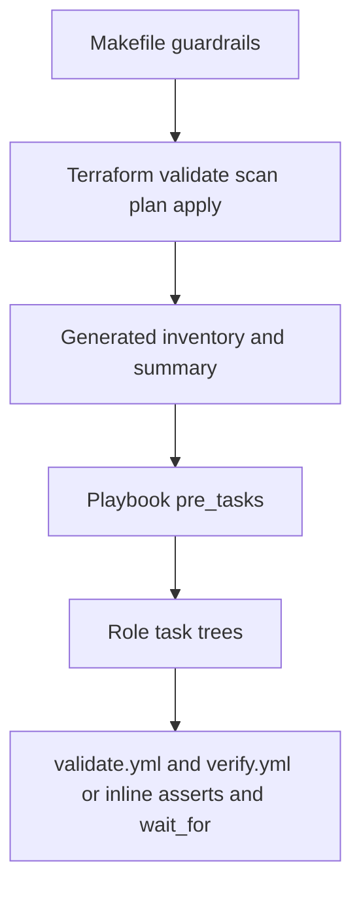

# Execution Patterns and Verification

## Primary Sources

- [terraform-proxmox/Makefile](../../terraform-proxmox/Makefile)
- [README.md](../../README.md)
- [user-man/main.yml](../../user-man/main.yml)
- [time_sync/main.yml](../../time_sync/main.yml)
- [bootstrap_playbooks/freeipa/main.yml](../../bootstrap_playbooks/freeipa/main.yml)
- [bootstrap_playbooks/keycloak/roles/keycloak/tasks/main.yml](../../bootstrap_playbooks/keycloak/roles/keycloak/tasks/main.yml)
- [bootstrap_playbooks/observability/roles/observability/tasks/main.yml](../../bootstrap_playbooks/observability/roles/observability/tasks/main.yml)
- [bootstrap_playbooks/zabbix_server/roles/zabbix_server/tasks/main.yml](../../bootstrap_playbooks/zabbix_server/roles/zabbix_server/tasks/main.yml)
- [bootstrap_playbooks/zimbra/roles/zimbra/tasks/main.yml](../../bootstrap_playbooks/zimbra/roles/zimbra/tasks/main.yml)
- [bootstrap_playbooks/oracle819c/main.yml](../../bootstrap_playbooks/oracle819c/main.yml)
- [bootstrap_playbooks/oracle_weblogic12c/main.yml](../../bootstrap_playbooks/oracle_weblogic12c/main.yml)
- [bootstrap_playbooks/oracle_weblogic14c/main.yml](../../bootstrap_playbooks/oracle_weblogic14c/main.yml)

## Why This Chapter Exists

The current repository does not rely on one central validation harness. Verification is distributed across:

- Terraform and Makefile guardrails
- playbook `pre_tasks`
- role-level `validate.yml` and `verify.yml` files
- inline `assert`, `wait_for`, and service checks inside larger playbooks

That means the useful documentation target is not a deleted log bundle. It is the execution logic that is still present in the codebase.

## Terraform Workflow Guardrails

The Makefile exposes several verification surfaces before and during provisioning:

- `check-tools` validates local toolchain readiness
- `validate` runs `terraform validate`
- `tf_scan` combines custom policy scanning, `tflint`, and `tfsec`
- `plan` validates inputs, selects the workspace, ensures `environments/<env>.tfvars` exists, and can auto-run `vault-bootstrap` before retrying
- `apply` runs `snippets`, then `plan`, then `terraform apply`, then `generate-inventory`
- `deploy` wraps `fmt`, `init`, `validate`, workspace setup, `plan`, and `apply`

The same Makefile also defines where generated outputs land:

- `plans/`
- `logs/`
- `summaries/`
- `backups/`
- `snippets/`

These are operational byproducts of the workflow, not hand-maintained documentation sources.

## Playbook Entrypoint Pattern

Most playbooks follow the same high-level shape:

1. target a semantic inventory group from `inventories/aliases.ini`
2. run `pre_tasks` for controller-side inputs and platform checks
3. execute one role or one large inline task tree
4. run verification tasks or post-task summaries

Common `pre_tasks` patterns in the current codebase include:

- bootstrap Python 3 on targets when needed
- gather facts after Python is available
- read optional project-local `.env` files from `playbook_dir`
- assert required passwords or artifact paths before installation begins

Examples:

- `user-man/main.yml` asserts supported `ansible-core` and Python 3.9+ on managed hosts
- `time_sync/main.yml` bootstraps Python, gathers facts, and applies `TIME_SYNC_*` overrides from a local `.env`
- `freeipa/main.yml` reads `FREEIPA_*` values from `.env` and sets install-time facts
- WebLogic `main.yml` files assert control-node installer archives and password requirements before service work starts

## Role-Level Verification Patterns

Several service projects use an explicit validation pipeline inside their role task tree.

Current examples:

- `time_sync`: `validate-vars.yml` -> setup tasks -> `verify.yml`
- `freeipa`: `validate.yml` -> install/firewall tasks -> `verify.yml`
- `keycloak`: `validate.yml` -> packages/database/install/configure/service -> `verify.yml`
- `observability`: `validate.yml` -> packages/configure/service -> `verify.yml`
- `zabbix_server`: `validate.yml` -> repo/packages/database/config/backups/firewall/service`
- `zimbra`: `validate.yml` -> prepare/install -> `verify.yml`

This is the clearest codebase-level answer to "how does the repo check itself?" for the newer service projects.

## Inline Verification in the Larger Playbooks

Oracle and WebLogic are older, larger playbooks and use a different style:

- strong `pre_tasks` assertions for required secrets and controller-side artifacts
- inline `assert` checks for compatibility and mountpoint expectations
- `wait_for` tasks around ports and service readiness
- post-task artifact collection in the Oracle projects

So the repo has two validation idioms:

1. explicit role-level `validate` and `verify` files
2. larger monolithic playbooks with embedded asserts, readiness waits, and post-task summaries

Both are current code patterns and both should be documented.

## What Counts as a Generated Output

The repo produces several classes of execution output:

- Terraform plans and logs under `terraform-proxmox/`
- deployment summaries moved into `summaries/`
- generated inventories under `inventories/<env>/`
- Oracle controller-side artifact directories when artifact tasks are enabled

These outputs are useful for operators, but they are derived from the workflow. The documentation should describe how they are produced, not depend on a single saved example remaining in the repo forever.

## Verification View

## Documentation Guidance for This Layer

- Describe verification in terms of code paths, not ad-hoc output snapshots.
- Call out where checks live: Makefile, `pre_tasks`, role task files, and inline assertions.
- Treat generated logs and summaries as workflow outputs, not as the foundation of the docs.
- Keep idempotency language tied to playbook structure and task design, not to a deleted external report.
