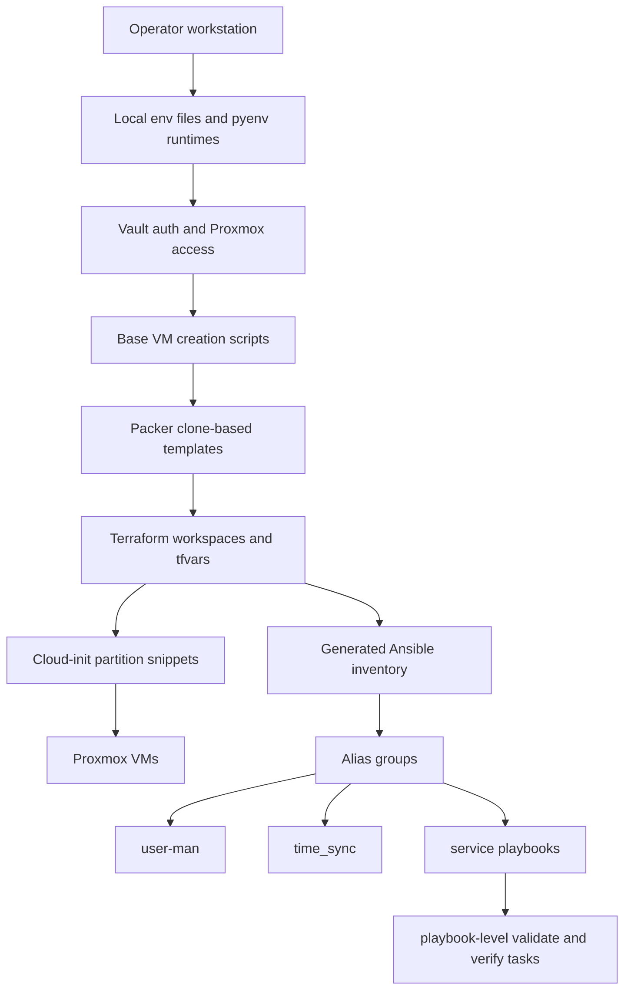

# v01 Universal Docs

This folder is a codebase-oriented documentation set for the monorepo. It is written against tracked directories, entrypoints, example files, and generated outputs that still exist in the repository. It does not depend on one-off run logs or deleted validation notes.

The documentation is organized around the platform lifecycle:

1. platform architecture
2. provisioning pipeline
3. environment inputs and generated outputs
4. host enablement
5. service bootstrap
6. execution patterns and verification
7. future ideas

## Source Model

This doc set separates five kinds of information:

- Code paths: tracked `main.yml`, role task files, templates, scripts, and `make` targets.
- Committed examples: `.env.example`, `vars.example.pkrvars.hcl`, `dev.tfvars`, and README usage blocks.
- Generated outputs: inventories, summaries, snippets, plans, and logs produced by the live workflow.
- Local operator inputs: `.env`, `secrets.auto.tfvars`, `.vault_password`, and environment-specific Packer vars.
- Future ideas: explicitly labeled suggestions that are not asserted as current behavior.

If a statement is not grounded in those sources, it belongs in the ideas appendix instead of the main chapters.

## Reading Order

| File | Purpose |
| --- | --- |
| [01-platform-architecture.md](./01-platform-architecture.md) | Repo map, layer model, and control-plane boundaries |
| [02-provisioning-pipeline.md](./02-provisioning-pipeline.md) | Base VM, Packer, Terraform, snippets, and inventory flow |
| [03-environment-enablement-and-artifacts.md](./03-environment-enablement-and-artifacts.md) | Local inputs, generated directories, and config precedence |
| [04-host-enablement.md](./04-host-enablement.md) | Why `user-man` and `time_sync` are baseline layers |
| [05-service-bootstrap.md](./05-service-bootstrap.md) | Service map, target groups, and per-project assumptions |
| [06-execution-patterns-and-verification.md](./06-execution-patterns-and-verification.md) | How execution checks and verification are encoded in the current codebase |
| [07-future-ideas.md](./07-future-ideas.md) | Clearly separated expansion ideas |

## Primary Repo Sources

- [README.md](../../README.md)
- [terraform-proxmox/README.md](../../terraform-proxmox/README.md)
- [terraform-proxmox/Makefile](../../terraform-proxmox/Makefile)
- [terraform-proxmox/main.tf](../../terraform-proxmox/main.tf)
- [inventories/README.md](../../inventories/README.md)
- [inventories/aliases.ini](../../inventories/aliases.ini)
- [bootstrap_playbooks/README.md](../../bootstrap_playbooks/README.md)
- [user-man/README.md](../../user-man/README.md)
- [time_sync/README.md](../../time_sync/README.md)

## Platform-at-a-Glance

## Quick Navigation by Task

- "I need to understand how environments are built from scratch."
  Read [02-provisioning-pipeline.md](./02-provisioning-pipeline.md).

- "I need to understand what local files matter and what gets generated."
  Read [03-environment-enablement-and-artifacts.md](./03-environment-enablement-and-artifacts.md).

- "I need to understand why engineers can log into and use the hosts after provisioning."
  Read [04-host-enablement.md](./04-host-enablement.md).

- "I need the service-level map without reading every playbook."
  Read [05-service-bootstrap.md](./05-service-bootstrap.md).

- "I need to understand where the repo encodes checks, preconditions, and verification."
  Read [06-execution-patterns-and-verification.md](./06-execution-patterns-and-verification.md).

## Boundaries

This doc set does not try to invent:

- a network design that is not visible in tracked files
- capacity numbers that are not explicitly documented
- storage policies beyond what scripts, tfvars, and READMEs show
- a single all-in-one orchestration flow when the repo is intentionally split across projects
- deleted scratch files as required reading
